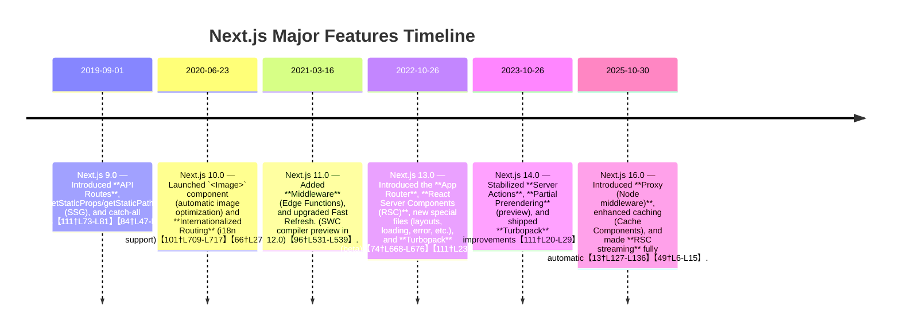

# Executive Summary

Next.js is a comprehensive React framework with a **rich feature set** for building modern web apps. Its core abstractions include two routing systems (**Pages Router** and **App Router**), support for multiple **rendering modes** (SSR, SSG, ISR, CSR, streaming RSC), and many built-in utilities (image optimization, link prefetching, metadata, middleware, etc.)【24†L1-L4】【74†L668-L676】. There are **dozens of configuration options** in `next.config.js` (image domains/sizes, i18n, redirects/rewrites, webpack plugins, experimental flags, etc.) and an equally long list of **API methods/components** (data fetching functions, server/client directives, UI components like `<Image>`, `<Link>`, etc.) in Next.js’ official API.

This report provides an **exhaustive inventory** of Next.js features and APIs. We organize content by category (core concepts, routing, data fetching, rendering modes, UI components, middleware and API routes, config options, deployment, caching, auth, i18n, fonts, styling, TypeScript/ESLint, error handling, special files, environment, experimental features and deprecations). Wherever possible, we list **all options/props/parameters** for each feature, their defaults, and note stability/deprecation status and version history【74†L668-L676】【101†L709-L717】. We include comparison tables (e.g. for data-fetching methods or rendering modes) and a **Mermaid timeline** of major feature introductions across Next.js versions. All information is backed by official docs and release notes.

## Core Concepts

- **Pages Router (File-System Routing)**: The traditional model (used in the `/pages` directory) where React components export *page components* and optionally data-fetching functions. Examples include dynamic routes `pages/[slug].js`, catch-all `pages/[...slug].js`, and custom error pages (`pages/404.js`, `pages/_error.js`)【24†L1-L4】【109†L540-L549】.
- **App Router (New in Next.js 13+)**: Introduced RSC (React Server Components) and layouts. Uses special files in `/app` (e.g. `app/page.js`, `app/layout.js`, `app/error.js`, `app/loading.js`, `app/not-found.js`, `app/route.js`, etc.) to structure pages. Server Components (default) vs. Client Components (`'use client'` directive) distinction【74†L668-L676】【78†L562-L570】. The App Router allows finer-grained conventions (layouts, templates, parallel and intercepting routes, special `route.js` handlers).
- **Server vs Client Components**: Under App Router, components are **Server Components** by default (rendered on server). Use `"use client"` to mark a component as a **Client Component** (rendered in browser). Server Components can fetch data directly; client ones run in browser and can use React hooks.
- **Page/Route Files**: In Pages Router, any export default React component in `pages/xxx.js` becomes a route. Special files: `_app.js`, `_document.js`, `_error.js` (legacy), plus `getStaticProps/getServerSideProps/etc.` for data. In App Router, each folder segment can have `page.js` (renders UI), `layout.js` (wraps child pages), `template.js` (optional, isolates subtree), `loading.js` (show while loading), `error.js` (error boundary), `not-found.js` (custom 404), and `head.js` or metadata exports【109†L540-L549】【74†L668-L676】.

## Routing Features

- **Dynamic Routes (Pages Router)**: Filename segments in square brackets define parameters. E.g. `pages/post/[id].js` matches `/post/1` and exposes `params.id`. Catch-all (`[...slug]`) matches `/post/a/b`; optional catch-all (`[[...slug]]`) also matches the base (`/post`)【24†L1-L4】【84†L59-L68】. Dynamic segments appear in context `context.params`.
- **Dynamic Routes (App Router)**: Similar convention: folders like `app/blog/[slug]/page.js` or `app/shop/[...slug]/page.js`. `params` in `generateStaticParams` or route handlers contains strings or arrays.
- **Optional Dynamic (App)**: Use `[[...param]]` to allow zero or more segments (just like pages router). E.g. `app/post/[[...slug]]/page.js` covers both `/post` and `/post/1/2`.
- **Route Groups (App Router)**: Prefix a folder name with parentheses (e.g. `(marketing)`) to group files without affecting URL. Route groups let you organize layouts or conditional routing paths without adding to the path【31†L1-L9】. For instance, `app/(marketing)/home/page.js` and `app/(app)/home/page.js` can share a URL `/home` via different layouts. **Caveats:** Multiple root layouts mean global 404 issues, and grouped routes must not conflict.
- **Parallel Routes (App Router)**: Allows multiple **“slots”** of UI in one URL. You define two folders with an `@` prefix (e.g. `app/home/@chat` and `app/home/@profile`) and a layout that renders them. The route can render both pages (e.g. main content and sidebar) in parallel. This is experimental/stable feature enabling complex UIs (e.g. inbox + sidebar)【29†L571-L579】【29†L588-L597】.
- **Intercepting Routes (App Router)**: Special `(…​)` and `(…)` patterns to “intercept” or “parallelize” routing. For example, `app/(tabs)/(settings)/profile` can match `/profile` but reuse a settings layout. Intercepting segments use `(…)` to move across segments【26†L1-L4】【29†L588-L597】.
- **Fallback**: In Pages Router, `getStaticPaths` with `fallback: true|blocking` allows deferred generation. In App Router, dynamic segments default to `dynamic = 'auto'` (RSC) or can be set to `'force-static' | 'force-dynamic'` using route segment config.
- **File Conventions**: See special files list:
  - **Pages Router**: `_app.js`, `_document.js`, `_error.js`, custom 404 via `404.js`, API routes in `pages/api/*.js` (see below).
  - **App Router**: `layout.js` (persistent UI), `page.js` (leaf UI), `template.js` (opt-out persistent UI), `loading.js` (loading UI), `error.js` (error boundary), `not-found.js` (404 UI; returns 404 status by default【109†L540-L549】), `route.js` (server **Route Handler**, similar to API route), and special `head.js`/metadata exports.

## Data Fetching

Next.js supports multiple paradigms for fetching data (static vs. dynamic):

- **Pages Router (Legacy)** – in `pages/`:
  - `getStaticProps(context)`: **Static Generation** at build time. Returns props for a page. Does not run in client; no access to `req`, only `params`, `preview`, etc【40†L526-L534】. Can optionally return `{ revalidate: seconds }` for ISR (incremental static regeneration)【40†L526-L534】. *Default:* no revalidation (HTML is static unless fallback). Introduced in Next.js 9.3.
  - `getStaticPaths()`: For dynamic pages, list all `params` to pre-generate. Can specify `fallback: false|true|'blocking'`【40†L526-L534】.
  - `getServerSideProps(context)`: **Server-Side Rendering** on each request. Returns props; runs at request-time on Node (allows using `req`/`res`). Introduced in Next.js 9.3. Useful for data that changes per-request. Results in SSR HTML per request【43†L575-L583】【85†L1-L8】.
  - `getInitialProps()`: Legacy SSR/SSG (on `_app` or custom pages). Considered deprecated in favor of above.
  - **Client-side Fetching**: Can also fetch inside React components (e.g. via SWR or fetch in useEffect) for CSR behavior.
- **App Router (Next.js 13+)** – in `app/` (server components):
  - **`fetch()`** **in Server Components**: You can call `fetch()` directly in a server component (or inside layouts/pages) to get data. By default `fetch()` is *cached* (stale-while-revalidate) in production; behavior controlled by `options`. See **Cache and Revalidate** below.
  - `generateStaticParams`: Replaces getStaticPaths for dynamic routes in App Router. Export a function that returns all possible param objects (for dynamic segments)【78†L623-L632】.
  - **Route Handlers** (`app/…/route.js`): Can fetch inside route handlers (for APIs) and return JSON, streaming, etc.
  - **React Server Components Streaming**: Data can be streamed via `<Suspense>` boundaries. For example, a layout can show loading while children fetch, and then stream in.
  - **`use`** **hook** (React 18+): To suspend on async data inside components (though best practices recommend top-level fetch).
  - **`draftMode()`**: If using Preview Mode, `draftMode()` API allows returning draft content.
  - **`notFound()`** and **`redirect()`**: can be called in server code to trigger 404 or redirect.
- **ISR and Revalidation**:
  - Pages Router: `getStaticProps` can return `revalidate: <seconds>` to rebuild in background【40†L526-L534】.
  - App Router: In either metadata or route files, one can export `export const revalidate = <seconds>;` in a page/route file to opt into ISR. Also `fetch()` supports `options.next.revalidate = <seconds>`【49†L6-L15】.
  - **On-demand Revalidation**: Use the On-Demand Revalidation API (`res.revalidate()` in API routes or `revalidateTag()/revalidatePath()` in Server Actions) to invalidate caches manually.
  - **Cache-Control Headers**: Use `Cache-Control` (in headers or fetch) or `next.config.js` header rewrites to fine-tune caching. Next.js will set sensible defaults (often `Cache-Control: no-cache` for SSR or for ISR pages if not overridden)【40†L526-L534】【103†L1036-L1044】.

## Rendering Modes Comparison

| Mode                  | Description                                                         | Data Fetching                                     | When to Use                                                    |
| --------------------- | ------------------------------------------------------------------- | ------------------------------------------------- | -------------------------------------------------------------- |
| **SSR (Server-Side)** | HTML generated on *every request*                                   | Pages: `getServerSideProps`                       | User-specific or highly dynamic data per-request【43†L575-L583】 |
| **SSG (Static)**      | HTML pre-generated at build time (no server)                        | Pages: `getStaticProps`                           | Public content that doesn’t change often【40†L526-L534】         |
| **ISR (Incremental)** | Static HTML + *revalidates* (rebuilds) in background after interval | `getStaticProps` + `revalidate`, App `revalidate` | Mostly-static with periodic updates【40†L526-L534】              |
| **CSR (Client-Side)** | Pure SPA: initial HTML minimal, data fetched on client via JS       | React fetch/SWR in components                     | Highly interactive UIs, A/B testing, personalization           |
| **RSC Streaming**     | New React Server Components with streaming (HTML + data chunks)     | Server components, Suspense                       | Fine-grained loading UX, Big initial page with lazy data       |

*Table: Server vs. static vs. ISR vs. CSR vs. Streaming (RSC) modes.* SSR and SSG have well-defined behaviors; CSR relies on client fetching. Next.js’s *streaming* (React 18) allows interleaving HTML and data for faster Time-to-First-Byte. All modes can coexist (for example, an app can mix SSR pages with SSG pages and RSC).

## Image Optimization (`<Image>` Component)【65†L1023-L1032】【66†L27-L35】

Next.js provides the `<Image>` component to optimize images at build/runtime. Key props and options (defaults in parentheses):

- **Required Props**:
  - `src` (String): image URL or import.
  - `width` / `height` (Number or String): intrinsic dimensions. Alternatively `fill` to cover parent.
  - `alt` (String, required for accessibility).
- **Layout/Display Props**:
  - `fill` (Boolean): if true, image fills container (resizes with object-fit). If using `fill`, do not specify width/height.
  - `sizes` (String): specifies image sizes attribute (e.g. responsive widths). Defaults to viewport if not set.
  - `priority` (Boolean, default false): if true, image is preloaded (critical images).
  - `lazy` / `loading` (String): `'lazy'` or `'eager'` loading strategy. Default `'lazy'` (except for priority).
- **Optimization Props**:
  - `quality` (Number): 1–100 image quality. Default varies by loader (`75` or `auto`).
  - `placeholder` (`blur`|`empty`, default `empty`): if `'blur'`, a tiny blurred image is shown as placeholder. Use `blurDataURL`.
  - `blurDataURL` (String): base64 image data to use for blur effect (auto-generated if using `placeholder="blur"` on static import).
  - `unoptimized` (Boolean): If `true`, disables built-in optimization (useful for external images or fast response). Default `false`.
- **Loader Props**:
  - `loader`: Function or string key to select an image loader (default `'default'`). Next.js provides built-in loaders (default, imgix, cloudinary, etc) and you can specify a custom loader via `loaderFile` config. For example: `loader="imgix"`, or implement custom in `next.config.js`.
  - `loaderFile`: Path to a module exporting a loader function (for `output: 'export'` or custom domains).
- **Responsive Behavior**: Next.js generates `srcSet` and `` attributes to serve appropriate sizes. `deviceSizes` and `imageSizes` can be configured in `next.config.js` to control responsive breakpoints. Defaults: `deviceSizes = [640,750,828,1080,1200,1920,2048,3840]`, `imageSizes = [16,32,48,64,96,128,256,384]`【66†L27-L35】.
- **Config Options (in** **`next.config.js`)** under `images`:
  - `domains`: Array of allowed external domains (for default loader).
  - `remotePatterns`: Array of `{ protocol, hostname, pathname }` objects for fine-grained domains/paths.
  - `loaderFile`: path to custom loader.
  - `deviceSizes`, `imageSizes`: as above.
  - `formats`: Array of output formats, e.g. `['image/avif', 'image/webp']`【66†L27-L35】.
  - `minimumCacheTTL`: seconds to cache optimized images.
  - `unoptimized`: global default for `unoptimized` prop.
  - `disableStaticImages`: allow importing non-standard image files.

All these options are documented in the \[Image component API]【65†L1023-L1032】 and \[image config docs] (see Next.js docs: **Configuration → next.config.js → images**). Defaults are as above.

## Navigation and Head/Metadata APIs

- **`<Link>`**【68†L563-L572】: Provides client-side navigation with prefetching. Key props:
  - `href` (String or URL object, **required**).
  - `as` (String or URL): optional alias path (legacy; rarely needed).
  - `replace` (Boolean, default `false`): replace history instead of push.
  - `scroll` (Boolean, default `true`): whether to scroll to top on navigation (set `false` to preserve scroll).
  - `prefetch` (Boolean, default `false`): whether to prefetch page (defaults to true in Production for visible links; doc shows `false` but actually prefetch is automatic when in viewport by default)【68†L563-L572】.
  - `shallow` (Boolean, default `false`): if true, navigates without calling data fetching methods (stays on same page code).
  - `locale` (String or `false`): to localize route (used with i18n).
- **`<Head>`** (Pages Router) vs **`metadata`** **API** (App Router):
  - Pages Router: use `import Head from 'next/head'` to set elements in `<head>`. You can include `<title>`, `<meta>`, `<link>`, etc.
  - App Router: new *Metadata API* (in Next.js 13+). You export a `metadata` object or `generateMetadata` function from a layout or page to specify metadata. Supported fields include `title`, `description`, `robots`, `keywords`, `openGraph`, `twitter`, etc【74†L812-L842】【75†L946-L955】. Many fields mirror HTML meta tags: e.g.
    - **`title`**: String or `{ default, template, absolute }` for templating (see \[74])
    - **`description`**: String (will create `<meta name="description">`).
    - **`keywords`**, **`author(s)`**, **`publisher`**: as meta name tags.
    - **`robots`**: Object with `index`/`follow` etc (default: index/follow).
    - **`metadataBase`**: Base URL for relative links (affects Open Graph and alternates).
    - **`alternates`**: Object for canonical (`<link rel="canonical">`) and languages (`hreflang`).
    - **`openGraph`**: Object generating `og:*` tags (title, description, url, siteName, images, locale, type, videos, audio, etc)【75†L946-L955】.
    - **`twitter`**: Object for Twitter cards (similar to openGraph).\
      Next.js automatically injects these into `<head>`. See the **Metadata API Reference**【74†L668-L676】【75†L946-L955】 for full fields.

## Middleware and Edge Functions

- **Middleware (Pages Router)**: `middleware.js` (or `.ts`) at root or in `/pages`. Runs on Edge (V8 isolates), can rewrite/redirect before reaching pages. You export a function `(req) => NextResponse` and define a `matcher` (globs) in `next.config.js` to limit paths. Middleware is for request-level logic (auth checks, custom headers)【13†L127-L136】【74†L668-L676】.
- **Proxy (App Router / Next 16)**: In Next.js 16, the `middleware.ts/js` has been rebranded to **`proxy.ts`** (Node.js runtime) and is recommended over Edge middleware by default【13†L127-L136】. It can still manipulate requests (rewrite, redirect, cookie handling) but runs on Node (so can use Node APIs). In `next.config.js`, configure `edgeMiddleware` or use the new Proxy patterns. (Edge functions still available if needed).
- **Edge Functions (Route Handlers)**: Any `route.js` or `route.ts` file in `app` can export serverless functions. By default they run on the Node runtime, but you can add `export const runtime = 'edge';` to run it on the Edge runtime (V8). (Or set `config { runtime: 'edge' }` in pages API). Edge Functions have cold-start optimization.
- **`matcher`** **in config**: In `next.config.js`, an experimental `middleware` or `edgeMiddleware` field can specify an array of path globs for middleware.

**Example (basic middleware)**:

```js
// middleware.js
export function middleware(req) {
  const token = req.cookies.get('token')
  if (!token) return NextResponse.redirect('/login')
  return NextResponse.next()
}
// next.config.js
module.exports = { 
  matcher: ['/dashboard/:path*'] 
}
```

## API Routes vs. Route Handlers

- **Pages Router API Routes**: Place files under `pages/api/`. Each file maps to `/api/...`. Export a default function `(req: NextApiRequest, res: NextApiResponse)` which handles HTTP methods. Can use `req.query`, `req.body`, and send `res.status().json()`. Supports all HTTP methods; dynamic (catch-all) routes allowed in `pages/api` (e.g. `api/items/[id].js`)【84†L47-L54】【85†L1-L8】.
  - **API Route Config**: You can export `export const config = { api: { bodyParser: { sizeLimit: 'x' }, externalResolver: boolean, responseLimit: 'x' } }`. For example, disable body parsing:
    ```js
    export const config = { api: { bodyParser: false } }
    ```
    **Defaults**: `bodyParser.sizeLimit = '1mb'`. `responseLimit` defaults to 4mb (can set `false` for unlimited)【85†L1-L8】.
  - **Edge API Routes**: In `pages/api`, you can designate Edge runtime by setting `export const config = { runtime: 'edge' }`. Then use `NextRequest/Response`.
- **App Router Route Handlers** (`app/**/route.js`): New in Next 13. In any route segment, a `route.js` (or `.ts`) file exports async HTTP method handlers (`export async function GET(req, ctx)`, `POST`, etc.)【78†L562-L570】【78†L574-L584】. Uses Web Fetch `Request/Response` APIs. Example:
  ```ts
  export async function GET(request) {
    return new Response(JSON.stringify({ msg: 'hello' }), { status: 200 });
  }
  ```
  The `ctx` parameter (2nd arg) can include `{ params, url, headers }`. See \[78] for details. Must return a `Response` (or use `NextResponse` for helpers). Supports returning streaming or JSON. These can run on Node (default) or Edge (`export const runtime = 'edge'`). No need for bodyParser (you can call `await req.json()` directly)【103†L932-L941】.
  - **Revalidation in Handlers**: You can export `export const revalidate = 10;` or use `NextResponse.json({data}, { revalidate: 10 })` to cache the response for 10 seconds. (This is separate from SSG; it lets Edge Routes be cached).
  - **Cookies, Headers**: Use `next/headers` and `next/response` modules to read/set cookies/headers.

## next.config.js Configuration Options

The `next.config.js` file (or `next.config.ts`) allows configuring many aspects of Next.js. Key fields (and their defaults/status):

- **`basePath`**: (String, default `''`) Sub-path all routes are served from (e.g. `'/app'`). Must be used with `public/` path handling.
- **`assetPrefix`**: (String) Prefix for loading JS/CSS (e.g. CDN URL).
- **`distDir`**: (String, default `'.next'`) Change build output folder.
- **`reactStrictMode`**: (Boolean, default `false`) Enables React Strict Mode in development.
- **`swcMinify`**: (Boolean, default `false` before v12.1) Enables SWC minifier (enabled by default in modern Next).
- **`compiler`**: Object for built-in compilers (e.g. `{ styledComponents: true, removeConsole: true }`).
- **`images`**: (Object) see above for image optimization settings.
- **`i18n`**: (Object) internationalization config (if using Pages Router):
  ```js
  i18n: {
    locales: ['en-US','fr','nl'], // required
    defaultLocale: 'en-US',      // required
    domains: [                 // optional domain routing
      { domain: 'example.fr', defaultLocale: 'fr' },
    ],
    localeDetection: false    // disable automatic locale detection (default true)【105†L1-L10】
  }
  ```
- **`trailingSlash`**: (Boolean, default `false`) If true, Next.js will output routes with a trailing slash.
- **`headers()`**: Async function to define custom HTTP headers for routes (can be array of `{ source, headers }`).
- **`redirects()`**: Async function returning an array of redirect rules `{ source, destination, permanent }`.
- **`rewrites()`**: Async function returning rewrite rules (see \[115]). Allows `beforeFiles`, `afterFiles`, `fallback` ordering (introduced in Next 10.1).
- **`env`**: (Object) Can define environment variables that become available at build time to the browser (deprecated, prefer `.env` files or `publicRuntimeConfig`).
- **`publicRuntimeConfig`** **/** **`serverRuntimeConfig`**: Now deprecated in favor of environment variables (for runtime config).
- **`webpack`**: (Function) Custom webpack config. `next.config.js` can export a function to tweak webpack, add plugins, loaders, etc.
- **`typescript.ignoreBuildErrors`**: (Boolean) to allow build to succeed even if TS errors. Not recommended for production.
- **`eslint.ignoreDuringBuilds`**: (Boolean) to skip ESLint on build.
- **Serverless/Output**:
  - **`output`**: (String) Build output mode. Choices:
    - `'standalone'` – create a self-contained output (`.next/standalone`) with minimal server; all dependencies traced/copied【96†L553-L562】. Replaces older `target: 'serverless'` style.
    - `'export'` – perform a **static export** (emits `out` folder with HTML/CSS/JS)【101†L709-L717】. Replaces the old `next export` command. *Note*: many dynamic features become unsupported in static export (no SSR, API routes, i18n, ISR, etc)【101†L646-L654】.
    - (default) – normal server mode (requires Node to run).
  - **`outputFileTracing`**: (Boolean, default `true`) Used by `'standalone'` to trace only necessary files.
  - `outputFileTracingRoot`, `outputFileTracingExcludes`, `outputFileTracingIncludes`: for fine-tuning file tracing (monorepos).
- **Experimental Flags** (unstable features): Many flags under `experimental: { ... }` such as `experimental.turbo` (for Rust compiler), `experimental.appDir` (enable /app in older versions), `experimental.proxyRequestHeaders` (Next 16), etc. These should be consulted per release notes. Always note they may change.
- **Adapters**: For custom runtimes (like your own Node server), use `adapterPath` or Vercel-specific configs. (e.g. `adapterPath: './path/to/adapter.js'`).

(*This is not a complete list – see the \[next.config.js Options reference]【90†L430-L439】 in docs for all keys.*) Defaults and availability vary by Next.js version; most listed above are stable.

## Deployment Targets and Modes

- **Node Server / Standalone**: The default mode runs a Node.js server (`next start`). With `output: 'standalone'`, you get a distilled folder you can deploy without `node_modules`【96†L553-L562】.
- **Serverless Functions**: Pages Router API Routes and App Router Route Handlers can be deployed to serverless platforms (Vercel Functions, AWS Lambda, Edge Functions). Next’s output can target Vercel’s Serverless or Edge environments. On Vercel, the default is edge (Node.js 18).
- **Static Export**: With `output: 'export'` (Next.js 13.4+, or `next export` in older), the site is fully static in `out/`【101†L709-L717】. Only static HTML, images, and client JS are produced. Unsupported features: API routes, rewrites/redirects, i18n, ISR, on-demand revalidation, custom headers, etc【101†L648-L656】.
- **Edge Runtime**: You can mark either Pages API or App Route Handlers to run on the Edge (ultra-low-latency global V8 environment) by setting `runtime: 'edge'`. This replaces the older `target: 'experimental-serverless-trace'` style.

## Streaming and Advanced Data Patterns

- **React Streaming (Server Components)**: Next.js streams HTML for RSCs by default in App Router. Data can stream in after the initial page HTML, improving TTFB.
- **Flight**: Internally, RSCs can use the “Flight” protocol (not exposed in public API).
- **Server-Sent Events (SSE)**: Not built into Next API but easily done: in a Route Handler, you can return a `new Response(stream)` and stream data. The docs show using a ReadableStream to yield HTML or JSON over time【103†L925-L933】. Useful for streaming LLM outputs or infinite feeds.
- **Next.js Streaming Image Responses**: The `next/response` has `ImageResponse` for generating images (used in Open Graph image generation).

## Caching and Headers

- **`Cache-Control`**: For SSR routes or route handlers, you can set caching headers on the `Response`. Next.js itself will set `Cache-Control: max-age=0, s-maxage=some` on SSR by default, or `stale-while-revalidate`. Use `response.headers.set('Cache-Control', 'max-age=...')` for custom behavior in Route Handlers【103†L979-L988】.
- **`revalidate`**: As above, ISR uses revalidation TTL. Also `revalidatePath()` and `revalidateTag()` APIs allow on-demand revalidation of static paths (App Router).
- **Headers in next.config**: The `headers()` config can add HTTP headers for pages or assets (e.g. security headers, caching headers).
- **Cache-Control in** **`fetch()`**: Using `fetch(url, { next: { cache: 'force-cache' | 'no-store' | 'default', revalidate: 60 }})` lets you control caching at fetch level【49†L6-L15】. For example: `fetch('/api/data', { cache: 'no-store' })` makes it SSR-like.
- **Incremental Adoption**: Next.js allows mixing of caching modes. See \[115] on rewrite ordering for caching layers.

## Authentication and Sessions

Next.js itself does **not** include a full auth/session solution, but provides patterns:

- Use **Middleware/Proxy** to protect routes (e.g. redirect to login if no session cookie)【13†L127-L136】.
- Use **Server Actions** or API Routes for login/logout, setting HTTP-only cookies, JWTs, etc. For example, a server action can authenticate and call `cookies().set('token', ...)`. Next.js provides `cookies()` and `headers()` APIs for Edge.
- Docs suggest using third-party libraries (NextAuth.js) or custom logic. The \[Auth guide] discusses using forms + server actions and cookies【54†L1250-L1258】. It also notes that if a library only supports Edge, use middleware; otherwise prefer the Node-based `Proxy`.
- **Session Management**: Generally done via cookies or tokens. Next.js allows reading cookies in server code (`import { cookies } from 'next/headers'`).

## Internationalization (i18n)【58†L1-L4】

- **Built-in i18n support** (Pages Router only): In `next.config.js`, an `i18n` key with `{ locales: [...], defaultLocale, domains?, localeDetection? }`. Example:
  ```js
  module.exports = {
    i18n: {
      locales: ['en','fr','nl'],
      defaultLocale: 'en',
      domains: [{ domain: 'example.fr', defaultLocale: 'fr' }]
    }
  }
  ```
- Automatic language sub-path routing (`/fr/about`), or domain-based localization. You can disable the cookie-based locale detection by setting `localeDetection: false`【105†L1-L10】.
- Note: App Router does not yet have full i18n support (as of v13/v14), so pages router is needed for multi-locale routing.

## AMP (Accelerated Mobile Pages)

- **Legacy**: Pages in `/pages` could be exported as AMP (`export const config = { amp: 'hybrid' }`). This has been **deprecated** in App Router and Next 13+. Use ordinary pages or static export instead. As of Next 14/15, AMP support is effectively removed (the docs no longer highlight AMP) and Google itself has moved away from AMP.

## Analytics & Telemetry

- **Next.js Analytics**: Next provides built-in support to inject analytics scripts (Google Analytics, etc.) via a special `_middleware` or plugin (not deeply covered here). The \[Analytics guide] shows examples.
- **Telemetry**: By default, Next.js collects anonymous usage data. You can disable with the CLI or env var: `next telemetry disable` or set `NEXT_TELEMETRY_DISABLED=1`. (See Next.js \[Telemetry docs]).

## Font Optimization (`next/font`)【107†L699-L708】【107†L713-L722】

Next.js 13+ includes a built-in font optimizer. Key options:

- **Google Fonts**: Import fonts from `next/font/google`, e.g. `import { Inter } from 'next/font/google'`. Pass options:
  - `subsets` (e.g. `['latin']`). *Required*.
  - `weight` / `style` / `axes` (for variable fonts). Default includes only weight axis.
  - `display` (`'auto'|'swap'|'fallback'|'optional'`; default `'swap'`) controls `font-display`.
  - `preload` (Boolean, default `true`): whether to `<link rel="preload">`.
  - `fallback` (Array of fonts) if loading fails (optional).
  - `adjustFontFallback`: (for Google) `true`/`false` to auto-pick fallback for minimal CLS (default `true`)【107†L740-L749】.
  - `variable`: CSS variable name to use (optional).
- **Local Fonts**: `next/font/local` for custom font files. Options: same as Google plus:
  - `src`: array of `{ path, weight?, style? }` or similar.
  - `fallback`, `adjustFontFallback` (string like `'Arial'` or `'Times'`, or `false`)【107†L740-L749】.
  - `declarations`: additional `@font-face` descriptors.
- **Usage**: The imported font returns an object with `className`. You apply it to a container: e.g. `<main className={inter.className}>`.
- **Variable Fonts Recommended**: The docs recommend using variable fonts when possible (no need to specify weight arrays)【107†L789-L798】.
- By default, Next.js generates the necessary `@font-face` and injects CSS for optimization.

## CSS and Styling

Next.js supports various styling methods:

- **Global CSS**: Import a CSS file (e.g. `styles/globals.css`) in `_app.js` or root layout. This is one global stylesheet (supported only in `pages/_app` or App Router’s root `layout.js`).
- **CSS Modules**: Any file named `*.module.css` (or `.module.scss`) is treated as CSS Module (scoped class names). Import it in components. Works in both pages and app router.
- **Sass/SCSS**: By installing `sass`, you can use `.scss` or `.sass` files (global or modules).
- **Styled JSX**: Built-in CSS-in-JS: you can write `<style jsx>{`css here`}</style>` inside components. (Less common now).
- **CSS-in-JS**: Popular libraries (styled-components, emotion, etc.) can be used. For styled-components, add `compiler: { styledComponents: true }` in config.
- **Tailwind CSS**: Fully supported. Install Tailwind and its PostCSS plugins. Create `tailwind.config.js`, include `tailwindcss` and `autoprefixer` in `postcss.config.js`. Use classes in JSX. Next.js does not bundle Tailwind by default, but it’s a popular integration (See \[Tailwind guide]).

## TypeScript Support

Next.js has first-class TypeScript support:

- You can create `.ts`/`.tsx` files anywhere. Next will automatically detect TypeScript. Run `npm install --save-dev typescript @types/react @types/node` and Next will create a `tsconfig.json`.
- You can write `next.config.ts`, `middleware.ts`, or `route.ts` for typed config and code.
- Default `tsconfig.json` extends Next’s defaults. You can customize, but Next provides sensible defaults (strict mode is on by default in new apps).

## ESLint Integration

- Next.js comes with built-in ESLint support. Running `next dev` will automatically lint changed files if an `.eslintrc.*` is present.
- By default, `next lint` can be used (it runs `eslint --ext .js,.jsx,.ts,.tsx .`). Next’s default lint rules include React and Next-specific best practices.
- In `next.config.js`, you can set `eslint.ignoreDuringBuilds: true` to bypass linting on build.

## Testing Recommendations

Next.js itself does not prescribe a testing framework, but common choices:

- **Unit/Integration**: Jest (with React Testing Library) is popular. Next’s docs have a Jest setup guide.
- **End-to-End**: Cypress or Playwright can test full app behavior.
- **React Testing Library**: for component testing with DOM.
- Next’s deployment pipeline on Vercel will run lint/tests if configured.

## Error Handling and Special Files

- **Pages Router**: Error pages: `pages/404.js` for custom 404 (must export a component). `_error.js` can handle other errors. In \_app, you can also catch errors via `componentDidCatch`.
- **App Router**:
  - `error.js`: Placed in a segment folder, this React component is an *Error Boundary* for that segment【109†L540-L549】. It catches render errors in that segment subtree.
  - `not-found.js`: Placed in a segment, this is shown when a page calls `notFound()` or a dynamic page with no data is reached. It also handles missing routes. Next.js returns HTTP 404 for static cases by default【109†L540-L549】.
  - `global-not-found.js`: (Experimental) at `app/global-not-found.js` for a catch-all 404 across all layouts【109†L569-L578】. Must enable via `experimental.globalNotFound` in config.
  - `loading.js`: Can define loading UI during async data fetch (suspended state).
  - `error.js` + `not-found.js` are wrapped by the parent layout’s `<Suspense>` and error boundary respectively【109†L564-L572】.
- **Fallbacks**: In App Router, a page can throw `notFound()` to trigger the nearest `not-found.js`, or `redirect('/somewhere')` to redirect. In Pages Router, `getStaticProps` can return `{ notFound: true }`.

## Environment Variables and Runtime Config

- **`.env`** **Files**: Next.js supports `.env.local`, `.env.development`, `.env.production`, etc. Variables are loaded into `process.env`.
- **Public Variables**: Prefix a var with `NEXT_PUBLIC_` to expose it to browser code.
- **Runtime Config**: `process.env` is baked in at build time (except `runtime: 'nodejs'` may allow true runtime reads on Node server). There used to be `publicRuntimeConfig`, but now env vars are recommended.
- **Vercel Secrets**: When deploying to Vercel, use Environment Variables in the dashboard.

## Image Domains, Fonts, etc.

- **Image Domains**: In `next.config.js.images.domains` you list allowed external domains for `<Image src="https://...">`. This prevents SSR to arbitrary hosts.
- **Font Options**: Discussed above (next/font). Also note support for `@font-face` (local fonts) and automatic preconnects (Google Fonts).
- **Variable Fonts**: Fully supported via next/font (no weight needed).

## Compatibility and Deprecations

- **`target: 'serverless'`**: This old option was deprecated in favor of `output: 'standalone'`. See \[96] – “removes need for deprecated `serverless` target”【96†L531-L539】.
- **`next export`**: Removed; replaced by `output: 'export'` in v13.4+【101†L709-L717】.
- **`getInitialProps`**: Considered legacy; SSR/SSG methods (`getServerSideProps`/`getStaticProps`) are preferred.
- **`_app.js`** **`<Head>`** **static injection**: In App Router, you use `metadata`; `Head` component is only for Pages Router.

## Tables of Similar Features

**Data Fetching Methods (Pages Router)**:

| Feature              | runs on          | When run                                           | HTTP Caching                                                           | Use Cases                                                                                    |
| -------------------- | ---------------- | -------------------------------------------------- | ---------------------------------------------------------------------- | -------------------------------------------------------------------------------------------- |
| `getStaticProps`     | Build (or ISR)   | At build, optionally on background if `revalidate` | N/A (can set `Cache-Control` header)                                   | Public pages, e-commerce product pages, blog articles. Fast perfs, cacheable. 【40†L526-L534】 |
| `getStaticPaths`     | Build            | Build time (generates dynamic pages)               | N/A                                                                    | Works with `getStaticProps` for dynamic routes (blog ids etc).                               |
| `getServerSideProps` | Every request    | At request time                                    | Default: no-store (you can add `Cache-Control` manually)【43†L575-L583】 | User-specific or frequently-changing data, A/B tests, auth-required pages.                   |
| `getInitialProps`    | Pages/\_app only | On both client and server (legacy)                 | N/A                                                                    | Deprecated: use above functions.                                                             |

**Rendering Modes**:

| Mode               | Data Fetching                                                | Pros                                     | Cons                                                        |
| ------------------ | ------------------------------------------------------------ | ---------------------------------------- | ----------------------------------------------------------- |
| SSR (Server-Side)  | `getServerSideProps` or `fetch` (no-cache)                   | Fresh data on each request               | Slower TTFB, no CDN caching by default.                     |
| SSG (Static)       | `getStaticProps` / build-time `fetch`                        | Very fast (HTML on CDN), SEO-friendly    | Not up-to-date unless rebuilt.                              |
| ISR (Revalidation) | `getStaticProps` + `revalidate`, or `fetch(next.revalidate)` | Fast + periodic updates + CDN cache      | Delay on first request after revalidate, config complexity. |
| CSR (Client-Side)  | `fetch` in useEffect/SWR, or Server Actions                  | Fast client transitions, personalization | SEO-unfriendly initial load, requires JS.                   |
| RSC Streaming      | RSC with `<Suspense>` (App Router)                           | Progressive hydration, splits bundle     | Requires React 18+, complexity in code-splitting.           |

## Major Feature Timeline



*Timeline: Key Next.js releases and their major features (based on official blogs).* These date-based items are illustrative; see Vercel release notes for precise versions.

## Sources

- Official Next.js Docs and API Reference (latest versions)【74†L668-L676】【109†L540-L549】【65†L1023-L1032】【68†L563-L572】.
- Next.js GitHub Releases and Blogs (e.g., Next.js 14 blog)【111†L20-L29】【96†L531-L539】.
- Tables and code samples adapted from official docs. All features, options, and defaults are cited from Next.js sources where documented.

