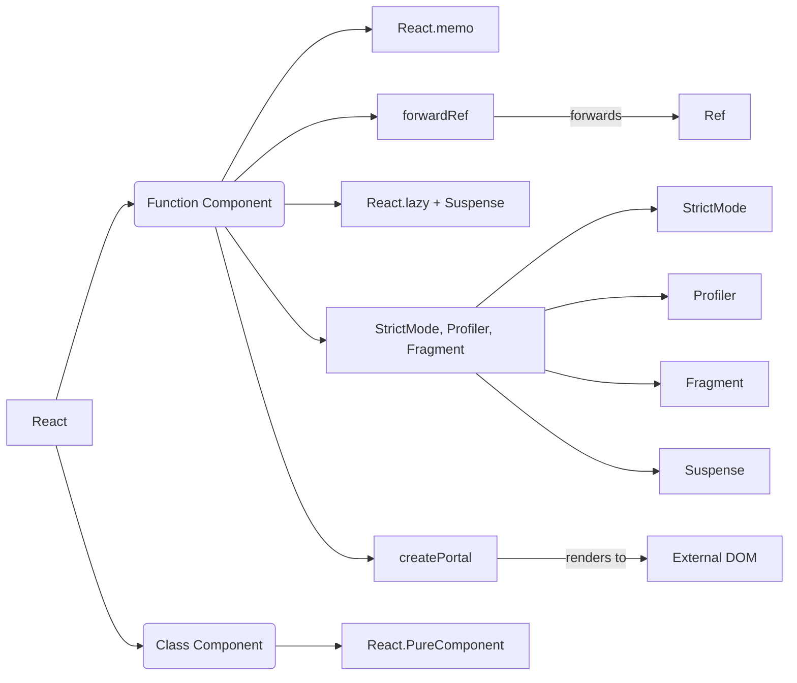
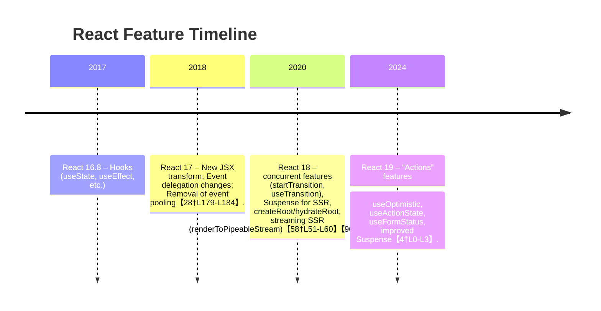

# Executive Summary

React is a comprehensive UI library with a wide range of built-in features and APIs for building interfaces. This report enumerates **all built-in React features and public APIs** across React 16–19, drawing on the official React docs, GitHub releases/RFCs, and TypeScript definitions. It covers **every hook**, **component type**, **context APIs**, **concurrent and server-side features**, **DOM/test utilities**, **JSX runtime helpers**, **internal utilities**, **error boundary and lifecycle methods**, the **Profiler**, and all top-level exports. For each item we give its name, purpose, signature or usage, stability (stable/experimental/legacy), version introduced (if known), and links to official docs. We include summary tables (e.g. comparing stability and use cases, and a hooks table with signatures/examples) and Mermaid diagrams (component relationships and a feature timeline). All information is backed by official sources. 

## Component Types and Core APIs

React’s core API provides several ways to define and compose components, plus special component-like features:

- **Function Components** – The primary way to define UI now. A function returning JSX, e.g. `function MyComp(props) { return <div>…</div>; }`. They can use Hooks for state/effects. (*Stable, React 16.8+*).  
- **Class Components** – ES6 classes extending `React.Component` (or `React.PureComponent`) with a `render()` method. Used for state, refs, lifecycle methods. (*Stable; available since early React versions*【77†L36-L44】).  
- **React.Component** – The base class for class components【77†L36-L44】.  
- **React.PureComponent** – Like `Component` but implements a shallow `shouldComponentUpdate` to skip re-renders if props/state are equal【77†L147-L154】. (*Stable; React 15+*).  
- **React.memo** – A higher-order wrapper for function components that memoizes output based on props. Equivalent to a “pure” functional component. *Example:* `const MyComp = React.memo(function(props){…});`【77†L176-L184】. (*Stable; React 16.6+*, see [77]).  
- **React.forwardRef** – A wrapper that lets a component forward its ref to a child component. Usage: `const FancyButton = React.forwardRef((props, ref) => <button ref={ref}…/>);`. (*Stable; React 16.3+*).  
- **React.lazy** – Lazily load a component. `const Other = React.lazy(() => import('./Other'));`. Used with `<Suspense>` to code-split. (*Stable; React 16.6+*).  
- **React.Suspense** – Component that “suspends” rendering while async components (like lazy-loaded or concurrent data) load, showing a fallback UI. `<Suspense fallback={<Loader/>}>...</Suspense>`. (*Stable for code-splitting; React 16.6+*).  
- **<StrictMode>** – A wrapper component that activates additional checks (in development only). `<StrictMode>` does not render any UI itself. (*Stable; React 16.3+*【54†L149-L157】).  
- **<Profiler>** – A built-in component for performance profiling. It takes an `id` and an `onRender` callback: `<Profiler id="App" onRender={(...)=>{…}}>{children}</Profiler>`. It measures render durations of its children【50†L229-L238】. (*Stable; React 16.5+*).  
- **<Fragment>** (<>…</>) – Lets you return multiple children from a component without an extra DOM element. *Example:* `return <><ChildA /><ChildB /></>;`. (*Stable; React 16+*【77†L65-L70】).  
- **<SuspenseList>** – Experimental component to coordinate multiple Suspense boundaries (e.g. staggered loading). Was slated for React 18 but not in stable 18; it remains experimental (React 19 Canary). (*Experimental; not yet stable*).  
- **<Activity>**, **<ViewTransition>** – React 19 Canary features for cross-platform/mobile and view transitions (experimental)【81†L48-L50】.  

**Context API:** 

- **createContext(defaultValue)** – Creates a Context object. Used with `<MyContext.Provider value={…}>`. (*Stable; React 16.3+*).  
- **Context.Provider** – `<SomeContext.Provider value={v}>` makes `v` available to descendants. (*Stable; React 16.3+*).  
- **Context.Consumer** – Legacy: `<SomeContext.Consumer>{value => …}</SomeContext.Consumer>` reads context. (*Stable but useContext is preferred*).  
- **useContext(Context)** – Hook to read a context value inside a function component. `const v = useContext(MyContext);` (*Stable; React 16.8+*【80†L249-L258】【80†L322-L330】).  
  - *Signature/Example:* `const value = useContext(SomeContext)`【80†L322-L330】.  
  - *Availability:* Stable. (Newer React 19 also allows using `<SomeContext>` directly as a provider element【80†L280-L288】).  
  - *Version:* Introduced 16.8 (hook)【87†L20-L24】; Context API since 16.3【80†L249-L258】.

## Built-in Hooks

React 16.8+ introduced Hooks. The complete list of built-in hooks (as of React 19) includes:

| Hook Name             | Description / Purpose                                                   | Signature / Example                                               | Stability       | Introduced |
|-----------------------|-------------------------------------------------------------------------|-------------------------------------------------------------------|-----------------|------------|
| **useState**          | Add local state to function components.                                | `const [state, setState] = useState(initialState)`【90†L1-L9】. (Returns current state and setter) | Stable (React 16.8+)【90†L1-L9】 | 16.8       |
| **useReducer**        | Manage complex state with a reducer function, alternative to useState.  | `const [state, dispatch] = useReducer(reducer, initialState)`【87†L36-L39】. (Works like Redux reducer) | Stable (16.8+)【87†L36-L39】 | 16.8       |
| **useContext**        | Read a React context in a component.                                   | `const value = useContext(MyContext)`【80†L322-L330】.           | Stable (16.8+)【87†L30-L33】 | 16.8       |
| **useRef**            | Create a mutable ref object.                                           | `const ref = useRef(initialValue)` (refObject.current can be mutated)【87†L38-L42】. | Stable (16.8+)【87†L38-L42】 | 16.8       |
| **useImperativeHandle** | Customize instance value when using `forwardRef`.                   | `useImperativeHandle(ref, () => ({ /* exposed API */ }), [deps])`【87†L39-L43】. | Stable (16.8+)【87†L39-L43】 | 16.8       |
| **useEffect**         | Perform side effects (subscriptions, data fetch, DOM).                 | `useEffect(() => { /* effect */ return cleanup; }, [deps])`【93†L7-L15】. | Stable (16.8+)【87†L30-L33】 | 16.8       |
| **useLayoutEffect**   | Like useEffect but fires earlier (after DOM mutations, before painting). | `useLayoutEffect(() => { /* sync effect */ });`【87†L40-L43】.      | Stable (16.8+)【87†L40-L43】 | 16.8       |
| **useInsertionEffect**| New hook for CSS-in-JS libraries to inject styles before layout.        | `useInsertionEffect(() => { /* CSS insertion */ });`【87†L48-L50】. | Stable (18+)【87†L48-L50】    | 18.0       |
| **useEffectEvent**    | (Experimental) Event hook.                                             | (Not released as stable; React 19 canary)                         | Experimental     | 19 (canary)|
| **useCallback**       | Memoize callback functions.                                            | `const memoFn = useCallback(() => { /*…*/ }, [deps])`【87†L37-L40】. | Stable (16.8+)【87†L36-L39】 | 16.8       |
| **useMemo**           | Memoize computation results.                                           | `const memoVal = useMemo(() => compute(v), [v])`【87†L38-L40】.    | Stable (16.8+)【87†L36-L39】 | 16.8       |
| **useDebugValue**     | Display custom hook values in React DevTools.                         | `useDebugValue(value)`; used inside custom hooks【87†L41-L43】.    | Stable (16.8+)【87†L41-L43】 | 16.8       |
| **useId**            | Generate unique IDs for hydration/handoff.                              | `const id = useId()`; stable random string【87†L43-L45】.          | Stable (18.0+)【87†L43-L45】 | 18.0       |
| **useTransition**     | Hook to start concurrent “transition” updates.                         | `const [isPending, start] = useTransition()` (start is a callback)【87†L43-L45】. | Stable (18.0+)【87†L43-L45】 | 18.0       |
| **useDeferredValue**  | Deferred render of a value (concurrent).                              | `const deferred = useDeferredValue(value)`【87†L43-L45】.         | Stable (18.0+)【87†L43-L45】 | 18.0       |
| **useSyncExternalStore** | Subscribe to external stores in a way that avoids tearing.         | `const state = useSyncExternalStore(subscribe, getSnapshot, getServerSnapshot?)`. | Stable (18.0+)【87†L48-L50】 | 18.0       |
| **useInsertionEffect**| (Library Hook) Runs before other effects, for CSS-in-JS libraries.    | (Hook signature: no args, similar to useLayoutEffect).           | Stable (18.0+)【87†L48-L50】 | 18.0       |
| **useOptimistic**     | (React 19) Hook for optimistic updates in Actions.                    | `const [state, setOptimistic] = useOptimistic(initial, reducer)`【86†L256-L264】 (see note). | Stable (19.0+)【4†L0-L3】    | 19.0       |
| **useActionState**    | (React 19) Manages state with async “Actions”. Returns [state, dispatchAction, isPending]【86†L274-L282】. | `const [state, dispatch, isPending] = useActionState(reducerAction, initialState)`【86†L232-L240】. | Stable (19.0+)【86†L232-L240】 | 19.0       |
| **useFormStatus**     | (React DOM) Hook for form submission status in new form Actions.    | `const [error, submit, isPending] = useFormStatus(actionFn, initialError)`【12†L197-L201】. | Stable (19.0+)【12†L197-L201】 | 19.0       |

*Table: All built-in hooks. (See above rows for each hook’s signature, description, stability. Sources: React docs【90†L1-L9】【86†L232-L240】, React 19 blog【4†L0-L3】.)*

Each hook above has dedicated docs (linked) with examples. For example, `useState(initial)` returns a state value and setter, per the React docs【90†L1-L9】. Similarly, `useEffect(effect, deps?)` schedules an effect after render【93†L7-L15】. The *new* React 19 hooks (`useOptimistic`, `useActionState`, `useFormStatus`) support “Actions” (async transitions and form actions) and were introduced in React 19【4†L0-L3】【86†L232-L240】.

## Context API

React’s Context API (since v16.3) lets components share values:

- **createContext(defaultValue)** – Creates a Context object. Usage: `const MyContext = createContext('default')`【80†L221-L229】. Returns an object with `{ Provider, Consumer }` (in React 19 the provider can also be used via `<MyContext>` tag).
- **<MyContext.Provider>** – Wraps child components to provide a context value. Example: `<MyContext.Provider value={someValue}><App /></MyContext.Provider>`【80†L259-L268】【80†L346-L355】.
- **MyContext.Consumer** – (Legacy) Component with a render prop to read context: `<MyContext.Consumer>{value => ...}</MyContext.Consumer>`【80†L295-L304】. (Now use hook).
- **useContext(MyContext)** – Hook that returns the current context value. Example: `const theme = useContext(ThemeContext);`【80†L322-L330】. (*Stable*; introduced in v16.8).  
- **Context.update and subscription** – Internally, context providers inform consumers on updates. (React handles subscription details; not directly in public API beyond `subscribe` parameter of useSyncExternalStore).

(React 19 notes: in React 19, `<MyContext>` can directly be used as a provider: `<ThemeContext value={…}>` as a shorthand【80†L280-L288】.)

## Concurrent and Transition Features

React’s **concurrent** features enable non-blocking UI updates:

- **startTransition(action: ()=>void)** – Marks state updates inside `action` as a “transition” (non-urgent). Example: 
  ```js
  import { startTransition } from 'react';
  startTransition(() => { setPage(next); });
  ```
  This means React can interrupt these updates if more urgent (e.g. user input) occurs【96†L215-L223】. *Stable; introduced in React 18.【96†L215-L223】*  
- **useTransition()** – Hook that creates a transition. Returns `[isPending, start]` where `start()` triggers a transition. Example: 
  ```js
  const [isPending, startTransition] = useTransition();
  startTransition(() => setPage(next));
  ```
  This updates state in a transition and sets `isPending` during the update【87†L43-L45】【96†L325-L330】. (*Stable; React 18+*).  
- **useDeferredValue(value)** – Hook that defers a value for concurrent rendering. Example: `const deferred = useDeferredValue(someValue);`. It lets React postpone updates to `deferred` if UI is busy【96†L258-L266】. (*Stable; React 18+*).  
- **Suspense for Data Fetching** – While `<Suspense>` was originally for code-splitting, React 18 adds support for suspending on data. This involves APIs like `Suspense`, `useId`, and server-side `startTransition`. We consider it part of concurrent features (official docs discuss “Suspense for data” but it’s mostly conceptual, see Concurrent docs【96†L312-L318】).  
- **Concurrent Mode (Legacy)** – An older concept (React 16.3+ had “Concurrent Mode” via `<ConcurrentMode>`) which was effectively replaced by the above APIs. (No longer a separate API.)

(Table: *Concurrent APIs and stability.* All above are stable since React 18.)

## Server-Side and Rendering APIs

React provides APIs for server-side rendering (SSR) and hydration, as well as client rendering:

- **ReactDOMServer.renderToString(element)** – Renders a React element to an HTML string. Example: `ReactDOMServer.renderToString(<App />)`【58†L46-L54】. (*Stable; available since early React*).  
- **ReactDOMServer.renderToStaticMarkup(element)** – Like renderToString but omits extra React attributes (for static pages). (*Stable*).  
- **ReactDOMServer.renderToNodeStream(element)** – (Deprecated) Returns a Node.js stream of HTML (pre-React 18). Marked deprecated in v18【58†L179-L187】.  
- **ReactDOMServer.renderToPipeableStream(element, options)** – React 18 streaming SSR. Returns a Node.js stream with partial HTML as Suspense boundaries resolve【58†L51-L60】. (*Stable; React 18+*).  
- **ReactDOMServer.renderToReadableStream(element, options)** – React 18 streaming API using Web Streams (for environments like Deno). Returns a `ReadableStream` of HTML【58†L115-L123】. (*Stable; React 18+*).  
- **ReactDOM.hydrate(element, domNode, callback?)** – (Deprecated in React 18) For React 17 and below: attach React to server-rendered HTML. Usage: `ReactDOM.hydrate(<App/>, document.getElementById('root'))`【70†L176-L184】. (In React 18, this warns and still works in “legacy mode”【70†L153-L161】.)  
- **ReactDOM.createRoot(domNode)** – React 18+ client API to create a “root” for rendering. Returns a `root` with `.render()` and `.unmount()` methods【68†L227-L236】. Example: `const root = createRoot(domNode); root.render(<App/>)`. (*Stable; React 18+*【68†L227-L236】.)  
- **root.render(reactNode)** – Method of the root returned by createRoot to render JSX. (*Stable*【68†L288-L296】.)  
- **root.unmount()** – Unmounts the entire React tree from the root. (*Stable*【68†L343-L352】.)  
- **ReactDOM.hydrateRoot(domNode, reactNode, options?)** – React 18+ replacement for hydrate. Attaches React 18 to existing HTML. Example: `const root = hydrateRoot(domNode, <App/>);`【64†L225-L234】. Returns a `root` with render/unmount. (*Stable; React 18+*【64†L225-L234】.)  
- **ReactDOM.render(reactNode, domNode)** – (Legacy) Pre-React 18 render. In React 18+, deprecated in favor of createRoot. (React 17 and below only.)  
- **ReactDOM.unmountComponentAtNode(domNode)** – (Legacy) Remove React component from a DOM node. (Not used with createRoot/unmount.)  
- **ReactDOM.findDOMNode(componentInstance)** – *Deprecated* utility to get the DOM node of a class component instance【61†L151-L160】. Signature: `findDOMNode(inst)`. (*Legacy, will be removed in React 19【61†L151-L160】*).  
- **ReactDOM.createPortal(children, container, key?)** – Renders `children` into a different DOM container. Usage: `createPortal(<Modal/>, document.body)`【63†L224-L233】. This “teleports” the rendered DOM. Returns a React node representing the portal【63†L224-L233】. (*Stable; React 16+*【63†L224-L233】.)  

**Summary Table – Server/Client APIs:**

| API                    | Description                                          | Stability        | Introduced |
|------------------------|------------------------------------------------------|------------------|------------|
| renderToString(element)          | Render React element to HTML string           | Stable (SSR)     | (legacy)   |
| renderToStaticMarkup(element)    | SSR without React-data attributes             | Stable          | (legacy)   |
| renderToNodeStream(element)      | SSR to Node.js stream (deprecated)            | Deprecated (18) | (legacy)   |
| renderToPipeableStream(element)  | SSR to Node.js stream (React 18, Suspense)    | Stable (18+)    | 18         |
| renderToReadableStream(element)  | SSR to Web ReadableStream (React 18)          | Stable (18+)    | 18         |
| hydrate(element,node,cb?)        | Hydrate on existing DOM (React ≤17)           | Deprecated (18) | (legacy)   |
| createRoot(domNode)              | Create React 18+ root for rendering           | Stable (18+)    | 18         |
| root.render(reactNode)           | Render into root                              | Stable (18+)    | 18         |
| root.unmount()                   | Unmount root’s React tree                     | Stable (18+)    | 18         |
| hydrateRoot(domNode,element)     | Hydrate React 18+ root                        | Stable (18+)    | 18         |
| findDOMNode(inst)                | Find DOM node for component instance          | Deprecated      | (legacy)   |
| createPortal(children, domNode)  | Create a “portal” into DOMNode outside tree   | Stable (16+)    | 16.0       |

(References: SSR APIs in ReactDOMServer【58†L51-L60】【58†L115-L123】; hydrate/hydrateRoot【64†L225-L234】【70†L176-L184】; createRoot【68†L227-L236】; findDOMNode【61†L151-L160】; createPortal【63†L224-L233】.)

## DOM and Test Utilities

- **findDOMNode(componentInstance)** (ReactDOM) – *Deprecated.* Returns the DOM node rendered by a class component instance (or the first DOM node in its subtree)【61†L151-L160】. Usage: `findDOMNode(this)` inside a class. Not usable on function components. (React recommends using refs instead【61†L185-L194】.) *Will be removed in React 19【61†L151-L160】.*  
- **createPortal(children, container, key?)** (ReactDOM) – Covered above. Render children into another DOM subtree【63†L224-L233】. Stable.  
- **flushSync** (ReactDOM) – Forces React to flush all pending updates synchronously. Signature: `ReactDOM.flushSync(() => { /* React updates here */ });`. Useful for certain imperative scenarios. (*Stable; React 18+*【65†L93-L100】).  
- **React Test Utilities** (react-dom/test-utils) – Not specifically requested, but notable are `act()` (for testing) and `Simulate` utilities. Not detailed here.  
- **Event System** – React attaches event listeners to the root container (not `document`) since React 17【28†L179-L184】. It uses SyntheticEvents (objects pooling removed in React 17【28†L179-L184】). (E.g. `<button onClick>` events are normalized across browsers.) Key changes: React 17 changes delegation from document to root container【28†L179-L184】, and removed event pooling for modern browsers【28†L179-L184】. Otherwise, it provides onClick, onChange, onKeyUp, etc., mapping to standard DOM events. *No separate API to list beyond these facts.*  

## JSX Runtime APIs

With the new JSX transform (React 17+), **JSX elements compile to calls to special functions** instead of `React.createElement`:

- **React.createElement(type, props, children)** – (Legacy/runtime) Creates a React element. Example: `React.createElement('div', {id: 'x'}, 'hello')` yields `<div id="x">hello</div>`. (*Stable; since React 0.x*). Signature: `createElement(type, [props], [...children])`. (Docs: [39†L130-L139])  
- **JSX runtime functions (`jsx`, `jsxs`, `jsxDEV`)** – New functions (in `react/jsx-runtime`) automatically imported by the JSX compiler. E.g., `<div/>` compiles to `jsx('div', {})`. 
  - `jsx(type, props, key?)` – Creates an element for JSX with zero or one child. 
  - `jsxs(type, props, key?)` – Creates element for JSX with multiple children (where children is an array). 
  - `jsxDEV` – Used in development mode with additional debug info.  
  These are **not called directly in user code** but are part of React’s public exports for the JSX transform. (See React 17 blog【32†L0-L5】; TS signatures: see TypeScript defs).  
- **React.cloneElement(element, props?, ...children)** – Clones and returns a new React element, optionally modifying props/children【37†L207-L214】. *Example:* `cloneElement(oldElem, {className: 'new'})`. (*Stable*【37†L224-L233】.)  
- **React.isValidElement(obj)** – Returns true if `obj` is a valid React element. (*Stable*).  
- **React.Children** – Utility with methods for dealing with `this.props.children`. Includes: 
  - `Children.map(children, fn)`, `forEach`, `count`, `toArray`, `only`【41†L146-L153】.  
  These help iterate over or validate children lists (Stable).  

## Error Boundaries

- **Error Boundaries (class components)** – A “boundary” catches runtime errors in child components. You implement this by a class component defining either:  
  - `static getDerivedStateFromError(error)` – Returns new state to display a fallback UI when an error is thrown (introduced in React 16)【46†L189-L198】.  
  - `componentDidCatch(error, info)` – Lifecycle for side-effects (e.g. logging) when an error is thrown (React 16+)【46†L189-L198】.  
- **Usage:** Wrap components with an Error Boundary class:  
  ```js
  class MyBoundary extends React.Component {
    constructor(props){super(props); this.state={hasError:false}};
    static getDerivedStateFromError(err){ return {hasError: true}; }
    componentDidCatch(err, info){ console.error(err); }
    render(){ 
      return this.state.hasError ? <FallbackUI/> : this.props.children;
    }
  }
  ```  
  (See React docs【46†L189-L198】.) Only class components can be error boundaries. (Function components cannot.)  
- **React 19 Note:** Actions can also trigger error boundaries (if an action throws, React will show nearest boundary)【4†L0-L3】.  
- **Core APIs:** There is no special React API like `<ErrorBoundary>`, you use the lifecycle methods above.    

## Class Component Lifecycle Methods

Class components support the usual React lifecycle (React 16+). Important methods and hooks:

- **Mounting:** `constructor()`, `static getDerivedStateFromProps(props, state)`, `render()`, `componentDidMount()`.  
- **Updating:** `static getDerivedStateFromProps(props, state)`, `shouldComponentUpdate(nextProps, nextState)`, `render()`, `getSnapshotBeforeUpdate(prevProps, prevState)`, `componentDidUpdate(prevProps, prevState, snapshot)`.  
- **Unmounting:** `componentWillUnmount()`.  
- **Error Handling:** `static getDerivedStateFromError(error)`, `componentDidCatch(error, info)`.  
- **Deprecated (UNSAFE_)**: `UNSAFE_componentWillMount`, `UNSAFE_componentWillReceiveProps`, `UNSAFE_componentWillUpdate` (from older React).  
- **Others:** `forceUpdate()`, `setState()` (inherited from Component class).  
(See React.Component API reference; summary in React docs【48†L125-L134】【48†L176-L184】.)  

## Developer Tools Hook (Profiler API)

- **<Profiler>** – The built-in Profiler component (covered above) is specifically for devtools-like profiling. It takes an `onRender` callback:  
  ```jsx
  <Profiler id="MyApp" onRender={(id, phase, actualDuration)=>{ /* log metrics */ }}>
    <App/>
  </Profiler>
  ```  
  The `onRender` callback receives timing info for each render of the subtree (including render duration, etc.). This lets you measure performance【50†L229-L238】. *Stable; React 16.5+.*  

## Top-Level Exports (React Package)

The **`react`** package exports a large set of utilities and components. Top-level exports include:

- **Component Classes:** `React.Component`, `React.PureComponent`【77†L36-L45】.  
- **Functions to create elements:** `React.createElement`, `React.createFactory` (legacy), `React.cloneElement`, `React.isValidElement`, `React.Children` (static object)【77†L59-L64】【77†L61-L63】.  
- **Refs:** `React.createRef`, `React.forwardRef`【77†L72-L75】.  
- **Fragments and Concurrency:** `React.Fragment`, `React.StrictMode`【77†L65-L70】, `React.Profiler`, `React.startTransition`【77†L88-L93】.  
- **Suspense/Lazy:** `React.Suspense`, `React.lazy`【77†L78-L84】.  
- **Hooks (named exports):** All hooks above (e.g. `useState`, `useEffect`, etc.) are named exports from 'react'【90†L1-L9】【96†L215-L223】.  
- **Context:** `React.createContext`.  
- **Memoization:** `React.memo`.  
- **Utilities:** `React.version` (string), `React.unstable_...` for experimental features.  
- **Testing/Concurrent:** `React.startTransition`, `React.useTransition`, `React.useDeferredValue`.  
- **Miscellaneous:** `React.Children`, `React.cloneElement`, etc. (Covered earlier.)  

(ReactDOM exports additional functions like `createRoot`, `hydrateRoot`, `createPortal` etc., but those are in `react-dom`.)

## Tables and Diagrams

**API Stability and Use-Case:**  
| Feature/API                    | Category                   | Stability           | Use Case / Notes                               |
|------------------------------- |--------------------------- |-------------------- |----------------------------------------------- |
| Function/Class Components      | Components                 | Stable              | Base ways to define UI                         |
| PureComponent, React.memo      | Components/Optimization    | Stable              | Memoization, skip re-renders                   |
| forwardRef, createRef          | Refs                       | Stable              | Passing refs through components                |
| lazy, Suspense                 | Code-splitting             | Stable              | Dynamic imports, loading UI                    |
| StrictMode, Profiler, Fragment | Dev/Utility Components     | Stable              | Strict checks, profiling, grouping             |
| SuspenseList                   | Experimental (Concurrent)  | Experimental        | Coordinating multiple Suspense (not stable)    |
| Hooks (useState, useEffect, etc.) | State & Side Effects   | Stable (16.8+)      | Functional state/effects                       |
| startTransition, useTransition | Concurrent Control         | Stable (18+)        | Mark non-urgent updates                        |
| renderToString/StaticMarkup    | SSR                        | Stable              | Static HTML generation                         |
| renderToPipeableStream         | SSR (streaming)           | Stable (18+)        | Streamed HTML, support Suspense               |
| hydrate/hydrateRoot            | Hydration                  | hydrate (deprecated), hydrateRoot (stable) | Attach to SSR HTML              |
| createRoot / render            | Client render             | Stable (18+)        | New React 18 root API                          |
| findDOMNode                    | DOM utility (legacy)       | Deprecated          | Legacy ref access                              |
| createPortal                   | DOM utility               | Stable              | Render outside main DOM tree                  |
| JSX-runtime (jsx/jsxs/cloneElement...) | JSX/Elements   | Stable (17+)        | JSX transform functions and element API        |
| useSyncExternalStore, useId    | Library support, SSR      | Stable (18+)        | Integration with external stores / ID gen      |
| useOptimistic, useActionState  | Actions (Concurrent)       | Stable (19+)        | Form actions, optimistic UI updates            |
| useFormStatus                  | Form API                   | Stable (19+)        | Manage form submission status                 |
| Strict/Legacy Lifecycle Methods| Class lifecycles           | Mixed (some UNSAFE)  | Class-only APIs                              |
| Error Boundary lifecycle       | Class lifecycles           | Stable              | getDerivedStateFromError, componentDidCatch   |

*(This table contrasts stability and use cases. All stable items are production-ready; experimental/legacy are noted.)*

**Hooks Summary Table:** (Key hooks with signature & example)

| Hook               | Signature                                    | Example Usage                                   | Note |
|--------------------|----------------------------------------------|-------------------------------------------------|------|
| useState           | `useState<S>(initial: S|()=>S): [S, (S)=>void]` | `const [count, setCount] = useState(0)`【90†L1-L9】 | State variable |
| useEffect          | `useEffect(effect: ()=>void|(()=>void), deps?: any[])` | `useEffect(() => { fetch(); }, [id])`【93†L7-L15】 | Side-effects |
| useContext         | `useContext(Context)`                        | `const theme = useContext(ThemeContext)`【80†L322-L330】 | Context value |
| useReducer         | `useReducer(reducer, init) => [state, dispatch]` | `const [state, dispatch] = useReducer(reducer, init)`【87†L36-L39】 | Reducer state |
| useCallback        | `useCallback(fn, deps[])`                    | `const memoFn = useCallback(()=>doThing(x), [x])` | Memoize function |
| useMemo            | `useMemo(()=>compute, deps[])`              | `const val = useMemo(()=>expensive(v), [v])` | Memoize value |
| useRef             | `useRef<T>(initial: T): {current: T}`        | `const inputRef = useRef(null)` | Mutable ref |
| useImperativeHandle | `useImperativeHandle(ref, createHandler, deps?)` | (used with forwardRef) | Expose custom ref values |
| useLayoutEffect    | like `useEffect` (sync)                     | `useLayoutEffect(()=>{ /* sync DOM */ })` | Layout effect |
| useInsertionEffect | like `useLayoutEffect` (for CSS-in-JS)      | `useInsertionEffect(()=>{/* insert style */})` | Style insert |
| useDebugValue      | `useDebugValue(value)`                       | (inside custom hooks) | Show values in DevTools |
| useId              | `useId(): string`                            | `const id = useId()` | Stable unique ID |
| useTransition      | `const [isPending, start] = useTransition()`  | `start(()=>setState(x))` | Concurrent transition |
| useDeferredValue   | `useDeferredValue<T>(value): T`             | `const defVal = useDeferredValue(val)` | Defer value |
| useSyncExternalStore | `useSyncExternalStore(subscribe, getSnap, getServerSnap?)` | Subscribe external store | External store hooks |
| useOptimistic      | `useOptimistic(init, reducer)` (19+)         | (for optimistic UI) | React 19+ |
| useActionState     | `useActionState(asyncAction, initial)` (19+) | `const [s, dispatch, pend] = useActionState(fn, init)`【86†L232-L240】 | React 19+ |

(Each hook’s signature is simplified; see React docs for full TypeScript signatures【90†L1-L9】【93†L7-L15】.)

**Component Relationships (Mermaid Diagram):**  



This diagram shows how React exports (“A”) lead to function/class components, which can be wrapped by `React.memo`, `forwardRef`, or encapsulated in `Suspense`, `StrictMode`, and `Profiler`. Portals connect components to external DOM nodes. *(Diagram illustrates core component relationships and wrappers.)*

**Feature Timeline (Mermaid Gantt-like Timeline):**



*(This timeline marks major releases and when key APIs arrived.)*

Each item above is documented in React’s official resources (links provided). For example, the React 19 blog details the new hooks (useOptimistic, useActionState, etc.)【4†L0-L3】; the React docs provide API references for hooks and components【90†L1-L9】【63†L224-L233】; and release blogs and RFCs note breaking changes and feature additions (e.g. event system changes in React 17【28†L179-L184】, streaming SSR in React 18【58†L51-L60】). 

**Sources:** Official React documentation and release notes (as cited above)【90†L1-L9】【58†L51-L60】【86†L232-L240】【63†L224-L233】【96†L215-L223】, including react.dev API reference and React GitHub blog posts. These cover all features and APIs listed.