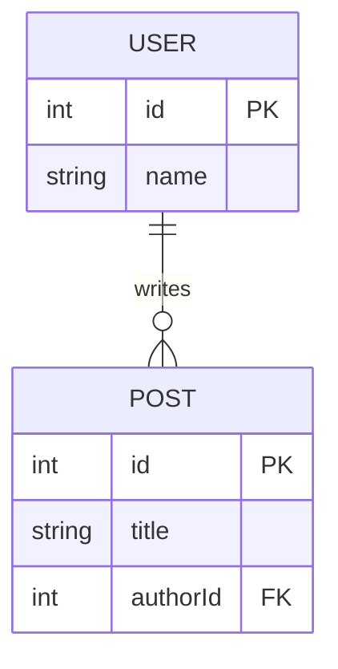
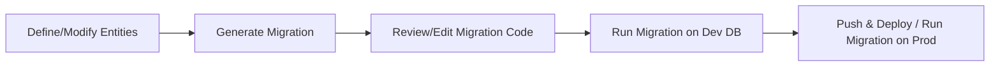

# TypeORM Features and APIs – Executive Summary

TypeORM is a comprehensive Object-Relational Mapper for Node.js and TypeScript that supports many databases (Postgres, MySQL/MariaDB, SQLite, MS SQL, Oracle, CockroachDB, MongoDB, etc.) and a full suite of ORM features. It allows defining *entities* as classes with decorators, rich relation mappings, migrations, and a powerful query API (Repositories, EntityManager, QueryBuilder). This report exhaustively catalogs **all** documented features and options of TypeORM as of 2026, drawn from the official docs and source. 

Key highlights: **Entities** are defined with decorators like `@Entity`, `@Column`, `@OneToMany`, etc., each accepting detailed options (see Table 1). **Columns** support many types and options (nullable, unique, precision, generated columns, etc.) and **relations** support one-to-one, one-to-many, many-to-many with join options and cascade/eager flags【21†L70-L79】【84†L633-L642】. TypeORM supports inheritance, embedded objects, view entities, and various constraints (indices, unique, check, exclusion) via decorators【84†L633-L642】【82†L139-L148】. 

For data access, **Repositories** and **EntityManager** expose dozens of methods: `find`, `save`, `update`, `delete`, plus aggregators (`count`, `sum`, etc.) and advanced operations like `upsert`【58†L233-L242】【65†L551-L560】. The **QueryBuilder** provides fluent SQL building with support for all operators and caching【58†L233-L240】【69†L52-L60】. Database **migrations** can be created manually or auto-generated; the CLI provides commands (`migration:create`, `migration:run`, `schema:sync`, etc.) for managing schema changes【72†L168-L177】. 

Connection and configuration options (`DataSourceOptions`) include driver-specific settings (pooling, replication, SSL, etc.), plus global flags like `synchronize` and `dropSchema` for schema sync【11†L65-L72】【89†L1-L4】. Each supported database driver has its own column types (listed in Table 3) and config options. Transactions support isolation levels per driver (e.g. SERIALIZABLE, READ COMMITTED), with TypeORM enforcing the database defaults【67†L90-L99】. Additional features include caching (query result cache via Redis or DB)【69†L52-L60】, naming strategies, logging modes, event listeners/subscribers for lifecycle hooks【86†L61-L70】【93†L369-L378】, tree repositories for hierarchical data, and both Active Record (entities extending `BaseEntity`) and Data Mapper patterns【68†L86-L95】【68†L115-L123】. 

Below is a detailed inventory of every decorator, option, API method, CLI command, etc., with references to the official docs and API. 

## 1. Decorators and Parameters

All TypeORM decorators and their parameters are listed in Table 1. Each decorator has a name and accepts specific options (usually via an object or arguments). For example, `@Entity()` can take `{ name, database, schema, comment, engine, synchronize, orderBy }`【21†L70-L79】, and `@Column()` takes all entries of `ColumnOptions` (see below)【84†L633-L642】. Listener and subscriber decorators (e.g. `@BeforeInsert`, `@AfterLoad`, `@EventSubscriber`) have no parameters. See the docs for syntax.  

| **Decorator**                | **Parameters / Options** (all documented parameters)                                      |
|------------------------------|----------------------------------------------------------------------------------------|
| `@Entity(options?)`          | `name, database, schema, comment, engine, synchronize, orderBy`【21†L70-L79】.  Example: `@Entity({name: "user", schema: "public"})`. |
| `@ViewEntity(options)`       | `name, database, schema, expression, dependsOn`【79†L64-L73】. Example: `@ViewEntity({ expression: \`SELECT ...\` })`. |
| `@Column(type, options?)`    | All **ColumnOptions**: `type` (ColumnType), `name`, `length`, `onUpdate`, `nullable`, `update`, `insert`, `select`, `default`, `primary`, `unique`, `comment`, `precision`, `scale`, `unsigned`, `charset`, `collation`, `enum` (values or enum class), `enumName`, `asExpression`, `generatedType`, `hstoreType`, `array`, `transformer`, `utc`【84†L633-L642】. Example: `@Column("varchar", { length: 100, unique: true, default: "'N/A'" })`. |
| `@PrimaryColumn(options?)`   | Same options as `@Column` but `primary:true` implied【84†L633-L642】. |
| `@PrimaryGeneratedColumn(arg?, options?)` | Can take a generation strategy (e.g. `"increment"`, `"uuid"`, `"rowid"`, `"identity"`, or a sequence name) and `options` (like `{primaryKeyConstraintName}`). Default strategy is `"increment"`【95†L1-L4】【94†L19-L27】. Example: `@PrimaryGeneratedColumn("uuid")`. |
| `@ObjectIdColumn()`          | No options (for MongoDB ObjectId primary key). |
| `@CreateDateColumn(options?)`| Same as `@Column` (often of type `timestamp`). Automatically set on insert. |
| `@UpdateDateColumn(options?)`| Same as `@Column`. Auto-updated on update. |
| `@DeleteDateColumn(options?)`| Same as `@Column`. Used for soft-delete timestamp. |
| `@VersionColumn(options?)`   | Same as `@Column`. Automatically increments on each update. |
| `@Generated(strategy)`       | Generation column: `strategy` can be `"increment"`, `"uuid"`, `"rowid"`, or sequence details (depends on DB). Example: `@Generated("uuid")`. |
| `@VirtualColumn(options)`    | For virtual (computed) columns: options include `query: string` and `alias: string`. |
| `@Embedded()` / `@Column(() => Class)` | Used to embed another class as a column group. Takes no special options (just a class reference). Optionally you can supply `prefix: string` to customize column name prefix (not shown above). |
| `@Index()`                   | Can be placed on a property or class. Usage forms: `@Index(columns: string[], options?)` on class (to index multiple columns), or `@Index(options?)` on a property. Options: `name` (index name), `unique: boolean`, `spatial: boolean`, `concurrent: boolean`, `where: string`, `type: string` (for index type), etc.【82†L139-L148】. Example: `@Index(["firstName", "lastName"], { unique: true })`. |
| `@Unique()`                  | Placed on a class: `@Unique(columns: string[])` or `@Unique(name, columns[])`. Creates a unique constraint (note: for multi-col constraints; for single column use ColumnOptions `unique: true`【84†L633-L642】). |
| `@Check()`                   | Placed on a class: `@Check(name?, expression: string)`. Defines a SQL CHECK constraint. Example: `@Check("CHK_AGE", "age >= 0")`. |
| `@Exclusion()`               | **Postgres only**: `@Exclusion(expression: string)`. Adds an EXCLUDE constraint. |
| `@ForeignKey()`              | **Under development**: creates a foreign key constraint across tables (not commonly used; instead use relation decorators and JoinColumn). |
| `@OneToOne(typeFn, inverseFn?, options?)` | One-to-one relation. Options: `cascade`, `eager`, `nullable`, `onDelete`, `onUpdate`, `orphanedRowAction`, `deferrable`, etc.【35†L50-L59】【36†L31-L39】. Example: `@OneToOne(() => Profile, p => p.user, { cascade: true, eager: true })`. |
| `@ManyToOne(typeFn, inverseFn?, options?)` | Many-to-one (owner side). Options as above. Example: `@ManyToOne(() => User, user => user.posts)`. |
| `@OneToMany(typeFn, inverseFn, options?)` | One-to-many (inverse side). Options: `cascade`, `eager`, etc. No `onDelete` on inverse side. Example: `@OneToMany(() => Post, post => post.author)`. |
| `@ManyToMany(typeFn, inverseFn?, options?)` | Many-to-many. Options: `cascade`, `eager`, etc. Example: `@ManyToMany(() => Category, c => c.posts, { cascade: true })`. |
| `@JoinColumn(options?)`      | Specifies column for one-to-one/many-to-one owner side. Options: `name`, `referencedColumnName`, `foreignKeyConstraintName` (FK name), etc.【39†L311-L320】. Example: `@JoinColumn({ name: "profile_id" })`. |
| `@JoinTable(options?)`       | On many-to-many (owner side) or one-to-one (owner) to create join table. Options: 
   - `name`: join table name  
   - `joinColumn`: object with `name`, `referencedColumnName`, `foreignKeyConstraintName` (for owner side)【26†L719-L727】  
   - `inverseJoinColumn`: object with same keys (for inverse side)【26†L753-L761】  
   - `synchronize: boolean` (skip syncing)  
   Example: 
   ```ts
   @JoinTable({ 
     name: "post_categories",
     joinColumn: { name: "post_id", referencedColumnName: "id" },
     inverseJoinColumn: { name: "category_id", referencedColumnName: "id" }
   })
   ``` |
| `@RelationId()`             | Gets ID value of a relation. Usage: `@RelationId((entity: Class) => entity.relationName) property: type[]`. No options. |
| `@AfterLoad()`, `@BeforeInsert()`, `@AfterInsert()`, `@BeforeUpdate()`, `@AfterUpdate()`, `@BeforeRemove()`, `@AfterRemove()`, `@BeforeSoftRemove()`, `@AfterSoftRemove()`, `@BeforeRecover()`, `@AfterRecover()` | Entity listener hooks (on instance methods). These take no parameters and can only be used inside an `@Entity`. Called at lifecycle events【86†L81-L90】【86†L101-L110】. |
| `@EventSubscriber()`        | Class decorator for a subscriber. No parameters. Marks a class (implementing `EntitySubscriberInterface`) that listens to events for one or all entities. |
| *(Listener + subscriber methods)* | Subscribers implement interfaces (e.g. `beforeInsert(event)`, `afterUpdate`, `beforeQuery`, etc.) to hook events globally【93†L369-L378】【93†L531-L540】. |

**Table 1:** TypeORM decorators and their supported parameters (options). For column-related decorators, see the list of **ColumnOptions** above【84†L633-L642】. For relation options (cascade, eager, nullable, onDelete, etc.), see the **Relations** docs【35†L50-L59】【36†L31-L39】.  

## 2. Column Types (per Driver)

TypeORM supports many column types, which vary by database. Table 2 compares the **ColumnType** values supported by each driver. (Some types like `string` or `number` are mapped internally to native types.) We list key types by category:

| **Driver**      | **Supported Column Types** (supported type names)                                                                                  |
|-----------------|------------------------------------------------------------------------------------------------------------------------------------|
| **MySQL/MariaDB**  | `bit`, `tinyint`, `bool`, `boolean`, `smallint`, `mediumint`, `int`, `integer`, `bigint`, `decimal`, `dec`, `numeric`, `fixed`, `float`, `double`, `double precision`, `real`, `date`, `datetime`, `timestamp`, `time`, `year`, `char`, `varchar`, `text`, `tinytext`, `mediumtext`, `longtext`, `blob`, `tinyblob`, `mediumblob`, `longblob`, `enum`, `set`, `simple-array`, `simple-json`, `json`, `geometry`, `point`, `linestring`, `polygon`, `geography`, `geometrycollection`, `multipoint`, `multilinestring`, `multipolygon`, `tinyint width`, `generated` (see official docs)【9†L158-L164】. |
| **Postgres/Cockroach** | `smallint`, `integer`, `bigint`, `decimal`, `numeric`, `real`, `double precision`, `money`, `character varying`, `varchar`, `character`, `char`, `text`, `citext`, `hstore`, `bytea`, `bit`, `varbit`, `uuid`, `xml`, `point`, `line`, `lseg`, `box`, `path`, `polygon`, `circle`, `cidr`, `inet`, `macaddr`, `tsvector`, `tsquery`, `date`, `time`, `time with time zone`, `timestamp`, `timestamp with time zone`, `interval`, `bool`, `boolean`, `enum`, `simple-array`, `simple-json`, `json`, `jsonb`, (and arrays of many of these)【50†L7-L16】【51†L113-L122】. |
| **SQLite/SQLJS**   | `int`, `integer`, `tinyint`, `smallint`, `mediumint`, `bigint`, `int2`, `int8`, `character`, `varchar`, `varying character`, `nvarchar`, `text`, `clob`, `blob`, `real`, `double`, `double precision`, `float`, `numeric`, `decimal`, `boolean`, `date`, `datetime`, `json`, `simple-array`, `simple-json`【56†L1-L10】. |
| **Microsoft SQL Server** | `int`, `tinyint`, `smallint`, `bigint`, `decimal`, `numeric`, `float`, `real`, `money`, `smallmoney`, `char`, `varchar`, `text`, `nchar`, `nvarchar`, `ntext`, `binary`, `varbinary`, `image`, `xml`, `uniqueidentifier`, `date`, `datetime`, `datetime2`, `datetimeoffset`, `smalldatetime`, `time`, `timestamp`, `sql_variant`, `simple-array`, `simple-json`, etc.【45†L1-L9】【45†L21-L25】. |
| **Oracle**      | `number`, `numeric`, `float`, `binary_float`, `binary_double`, `char`, `nchar`, `varchar2`, `nvarchar2`, `clob`, `nclob`, `long`, `blob`, `timestamp`, `timestamp with time zone`, `timestamp with local time zone`, `date`, `interval year to month`, `interval day to second`, `xmlType`, `rowid`, `urowid`, `raw`, `long raw`, `simple-array`, `simple-json`, etc.【49†L1-L9】【49†L11-L17】. |
| **SAP HANA**    | `tinyint`, `smallint`, `integer`, `bigint`, `decimal`, `double`, `real`, `float`, `seconddate`, `date`, `time`, `timestamp`, `year`, `char`, `nvarchar`, `text`, `blob`, `clob`, `boolean`, `geometry`, `ST_GEOMETRY`, vector types (`vector`, `vector2`, ..., `vector300` as aliases)【52†L1-L9】【52†L11-L18】. |
| **Google Spanner** | `bool`, `int64`, `float64`, `numeric`, `string`, `json`, `bytes`, `date`, `timestamp`, `array` (of base types)【42†L21-L24】【42†L25-L28】. |
| **MongoDB**     | (No column types; use BSON types via decorators like `@ObjectIdColumn()`. TypeORM’s MongoDB support uses schema-less documents.) |

**Table 2:** Supported column types by database driver (TypeORM’s `ColumnType` values). See each driver’s docs for full lists. For example, MySQL/MariaDB types【9†L158-L164】 and Postgres types【50†L7-L16】【51†L113-L122】.

## 3. Entities, Columns, and Constraints

- **Primary/Generated Columns:** Use `@PrimaryColumn()` or `@PrimaryGeneratedColumn()` decorators for primary keys. Generated strategies include `increment` (SERIAL/AUTO_INCREMENT), `uuid`, `rowid` (SQLite), `identity` (Postgres 10+), and database sequences【95†L1-L4】.  
- **Version & Timestamp Columns:** `@VersionColumn()` for optimistic version (auto-increment on save); `@CreateDateColumn()`, `@UpdateDateColumn()`, `@DeleteDateColumn()` for timestamps (auto-managed)【28†L378-L387】【28†L396-L404】.  
- **Column Options:** All column decorators accept *ColumnOptions* (see Table 1). For example, `@Column({ type: "varchar", length: 150, unique: true, nullable: false, default: "''" })` produces a `varchar(150)` that is NOT NULL and UNIQUE【84†L633-L642】. Flags include `nullable`, `unique`, numeric precision/scale, `unsigned` (MySQL only), `charset`, `collation`, etc.  
- **Computed/Generated Columns:** PostgreSQL, MySQL, Oracle, SQLite, SQL Server, Cockroach, SAP HANA, and Spanner support generated columns. Use `@Column({ asExpression: "<expr>", generatedType: "STORED"|"VIRTUAL" })`【84†L664-L673】. These columns are computed from other columns.  
- **Enum Columns:** Use `@Column("enum", { enum: MyEnum, enumName: "custom_name" })` for Postgres/Cockroach, or `@Column("set" or "simple-enum", { enum: ... })` for MySQL. The `enumName` option sets the DB enum type name【84†L659-L668】.  

- **Indexes and Unique Constraints:**  
  - Use `@Index()` on columns or classes (see Table 1). E.g. `@Index({ unique: true })` on a column makes it UNIQUE【82†L108-L117】.  
  - Multi-column indexes: `@Index(["col1", "col2"], { unique: true })` on the class【82†L139-L148】.  
  - Spatial indexes (MySQL/Postgres/Cockroach with PostGIS): `@Index({ spatial: true })` on a spatial column【82†L173-L182】.  
  - Concurrent Postgres indexes: `@Index([...], { concurrent: true })` (requires `migrationsTransactionMode: "none"`)【82†L223-L231】.  
  - Check constraints: Use `@Check()`. E.g. `@Check("CHK_POSITIVE", "\"age\" >= 0")`.  
  - Exclusion constraints: `@Exclusion("...")` for Postgres (rare).  

- **Inheritance:** Abstract base classes can be used. TypeORM does not have single-table inheritance by default, but you can extend a base class with `@Entity()` on subclasses. See docs【84†L694-L702】.  

- **Embedded Entities:** Use `@Column(() => Class)` to embed columns from another class【80†L138-L147】【80†L154-L163】. By default, embedded column names are prefixed by the property name (see example in docs). You can customize prefix with `@Column(() => Class, { prefix: "custom_" })`.  

- **Tree Entities:** TypeORM supports trees (Adjacency List, Closure Table, Nested Sets). Decorators: `@Tree("closure-table")`, `@TreeParent()`, `@TreeChildren()`, etc.【8†L54-L62】. Tree entities automatically get tree-specific repositories with methods like `findTrees()`, `findDescendants()`, etc.  

- **View Entities:** Annotate classes with `@ViewEntity()` to map to a DB view【79†L61-L70】. Options: `expression` (SQL or QueryBuilder) is **required**; `name`, `schema`, `database`, and `dependsOn` (for migration ordering) can be given【79†L64-L73】. Inside a view entity, use `@ViewColumn()` on each property to map to selected columns in the view【79†L167-L175】.

- **Listeners & Subscribers:**  
  - Entity listeners: Decorate entity instance methods with `@BeforeInsert`, `@AfterLoad`, etc. These run on that entity’s events【86†L61-L70】【86†L81-L90】.  
  - Global subscribers: Decorate a class with `@EventSubscriber()` and implement `EntitySubscriberInterface`; it can listen to any entity events (like `beforeInsert`, `afterUpdate`) and even transaction events (`beforeTransactionCommit`, etc.)【93†L369-L378】【93†L531-L540】. Use subscribers for side effects like logging or validation.  

## 4. Repository, EntityManager and QueryBuilder APIs

**Repositories and EntityManager** share most data-access methods. Table 3 summarizes the core methods. (In general, repository methods operate on a specific entity class, whereas `EntityManager` can operate on any.)

| **Method**                    | **Description**                                                                                                                           |
|-------------------------------|-------------------------------------------------------------------------------------------------------------------------------------------|
| `find(options?)`             | Find many entities by *FindOptions* (with `where`, `order`, `skip`, `take` etc). Returns an array. 【60†L233-L242】【65†L551-L560】. |
| `findBy(where)`              | Shortcut to find with a simple object filter. E.g. `findBy({ firstName: "John" })`.                                                      |
| `findOne(options?)`          | Find first entity matching *FindOptions*. Returns one or `null`. (Use `findOneOrFail` if missing should throw.)                           |
| `findOneBy(where)`           | Find first entity matching a simple object condition (no extra options).                                                                 |
| `findOneOrFail(options)`     | Like `findOne`, but throws if no result.                                                                                                  |
| `findOneByOrFail(where)`     | Like `findOneBy`, but throws if not found.                                                                                               |
| `findAndCount(options?)`     | Finds entities + returns total count (ignoring pagination). Useful for pagination【59†L13-L21】【65†L571-L580】.                            |
| `findAndCountBy(where)`      | Same as above, but using simple object where clause.                                                                                        |
| `count(options?)`            | Count entities matching FindOptions.                                                                                                      |
| `countBy(where)`             | Count with simple object filter.                                                                                                          |
| `exists(options)`            | Returns `true` if any match FindOptions (SQL EXISTS query).                                                                               |
| `existsBy(where)`            | Returns `true` if any match simple where.                                                                                                |
| `sum(column, where?)`        | Sum of a numeric column for entities matching `where`.                                                                                   |
| `average(column, where?)`    | Average of a numeric column.                                                                                                             |
| `minimum(column, where?)`    | Minimum of a numeric column.                                                                                                             |
| `maximum(column, where?)`    | Maximum of a numeric column.                                                                                                             |
| `save(entity or array)`      | Insert or update given entity/entities (in one transaction). If an object has an ID, it updates; otherwise inserts. Returns saved entity/entities【60†L233-L242】. |
| `remove(entity or array)`    | Remove given entity/entities (by primary key).                                                                                           |
| `insert(entity or array)`    | Insert new entity/entities. Returns insertion result (IDs, etc.).                                                                         |
| `update(id/criteria, partialEntity)` | Update by ID or conditions. Accepts id, array of ids, or condition object(s). Example: `update({ age: 18 }, { active: false })`【63†L231-L240】. |
| `updateAll(criteria?, partialEntity, options?)` | **Repository-only**: Update all rows or those matching conditions. Example: `updateAll({ active: false })` updates every row.                                                     |
| `upsert(entity or array, conflictPaths, options?)` | Insert or update-on-conflict. Supported by Postgres, MySQL, SQLite, etc. Optionally specify `conflictPaths` or conflict constraints. TypeORM auto-updates special columns (`@UpdateDateColumn`, `@VersionColumn`) on conflict【60†L331-L340】【63†L261-L270】. |
| `delete(id/criteria)`        | Delete by primary key(s) or condition(s).                                                                                                 |
| `deleteAll()`                | Delete all entities (truncate table). Equivalent to `repository.clear()` (TRUNCATE).                                                       |
| `softDelete(id/criteria)`    | Soft-delete (sets delete timestamp) by id(s) or condition(s).                                                                             |
| `restore(id or entities)`    | Restore soft-deleted by id(s) or entity instances.                                                                                        |
| `softRemove(entity or array)`| Soft-remove entities (sets their delete timestamps). Returns updated entities.                                                           |
| `recover(entity or array)`   | Recover soft-removed entities.                                                                                                           |
| `increment(criteria, column, value)` | Increment a numeric column by value for rows matching criteria. Example: `increment({ active: true }, "count", 1)`.                          |
| `decrement(criteria, column, value)` | Decrement analogously.                                                                                                                   |
| `hasId(entity)`              | Check if entity has a (non-empty) primary key.                                                                                          |
| `getId(entity)`              | Return the value(s) of primary key for given entity (object or primitive or composite object).                                          |
| `create(data?)`              | Create a new entity instance (un-saved) with given data merged in.                                                                      |
| `merge(target, ...sources)`  | Copy data from plain objects into an entity object.                                                                                      |
| `preload(data)`              | Load an existing entity by ID (in `data`), replace its values from `data`, and return the new entity (or `undefined` if not found).     |
| `query(sql, parameters?)`    | Execute raw SQL query. Parameters may use `?`, or named (driver-dependent). Returns raw results.                                         |
| `createQueryBuilder(alias)`  | Start a `QueryBuilder` for custom queries. Returns a QueryBuilder instance【61†L79-L88】.                                                |
| `clear()`                    | **Repository-only**: Alias to `deleteAll()`. Clears all rows from the table.                                                             |

**Table 3:** Major Repository/EntityManager methods. (Methods exist on both `Repository<T>` and `EntityManager`, except where noted.) Most methods take either an entity class or name (implicit in a repository), and optional criteria objects. For full details see the *Repository API* docs【60†L233-L242】【65†L551-L560】. QueryBuilder APIs are listed separately below.

The **EntityManager API** also includes: `transaction(mode?, fn)`, which runs a function in a transaction (optionally with isolation level)【67†L84-L93】; `queryRunner`, `manager`, `options`, `initialize()`, `dropDatabase()`, `runMigrations()`, `undoLastMigration()`, `hasMetadata()`, `getMetadata()`, `getTreeRepository()`, `getMongoRepository()`, etc.【91†L90-L99】【91†L120-L129】. For example, `dataSource.getMetadata(MyEntity)` returns its metadata; `dataSource.getTreeRepository(Category)` returns a tree repo with methods like `findTrees()`【91†L120-L129】. 

### QueryBuilder Methods

The `QueryBuilder` provides a fluent interface for SQL. Common methods include: `select()`, `addSelect()`, `where()`, `andWhere()`, `orWhere()`, `orderBy()`, `groupBy()`, `limit`, `offset`, etc. It supports `innerJoin`, `leftJoin`, and their `AndSelect` variants for relations, as well as aggregate functions. Results are obtained via `getMany()`, `getOne()`, `getCount()`, `getRawMany()`, `getRawOne()`, etc. QueryBuilder also supports caching (`.cache(msOrId)`)【69†L88-L98】【69†L115-L123】, and parameter binding. All operators (`=, <>, >, <, >=, <=, IN, LIKE, BETWEEN, IS NULL`, etc.) can be used in `where` expressions. See the official *Query Builder* docs for the full API. 

## 5. Migrations and Schema Management

TypeORM includes a migrations system and CLI commands for schema management:

- **Migration API:** Write migrations by implementing `MigrationInterface` with `async up(queryRunner)` and `async down(queryRunner)`【76†L78-L86】【76†L102-L110】. Use `queryRunner.query("SQL")` or its specific methods to alter schema/data. The migration file example shows an `ALTER TABLE` in `up()` and its reversal in `down()`【76†L102-L110】.  

- **CLI Commands (from `typeorm`):** Key commands include:  
  - `typeorm init [--name project] [--database <type>] [--module esm|commonjs] [--express] [--docker]` – create a base project【72†L109-L118】【72†L130-L139】.  
  - `typeorm entity:create <path>` – generate a new entity file【72†L152-L156】.  
  - `typeorm subscriber:create <path>` – generate a new subscriber file【72†L158-L164】.  
  - `typeorm migration:create <path>` – create a new empty migration file【76†L62-L70】.  
  - `typeorm migration:generate <name>` – auto-generate a migration by comparing entity definitions to DB schema.  
  - `typeorm migration:run` – run all pending migrations (calls `DataSource.runMigrations()`).  
  - `typeorm migration:revert` – undo the last migration (calls `DataSource.undoLastMigration()`).  
  - `typeorm migration:show` – list all migrations and their execution status.  
  - `typeorm schema:sync` – synchronize database schema (create tables/columns to match entities). **Caution:** may drop/alter tables【11†L101-L104】.  
  - `typeorm schema:log` – show SQL that `schema:sync` *would* execute, without making changes.  
  - `typeorm schema:drop` – drop the entire database schema (all tables).  
  - `typeorm query "<sql>"` – run a raw SQL query.  
  - `typeorm cache:clear` – clear the query result cache (if using caching).  
  - `typeorm version` – print TypeORM version.  

CLI commands often take `-d <path>` to specify the DataSource config file (in JS/TS). They also allow options like `--name`, `--database`, etc. The **configuration file** is the DataSource (formerly `ormconfig`) and can be in `.ts`, `.js`, `.json`, etc. (For TS entities, the CLI typically uses `ts-node` adapters as shown【72†L69-L78】.) 

**Mermaid Diagram:** A simple ER example of TypeORM entity relations:  

*(This Entity–Relation diagram illustrates a one-to-many relation between User and Post.)*  

**Migration Workflow (Flowchart):** A timeline of typical migration steps:  

*(This flowchart outlines the migration process: updating entities, generating a migration, reviewing it, then running it in development and production.)*

## 6. Connections, Drivers, and DataSource Options

- **DataSource (Connection):** In TypeORM 1.0+, you create a `DataSource` (replaces old `createConnection()`). It is configured via `DataSourceOptions`【11†L66-L74】. Key options:  
  - `type`: database type (`mysql`, `postgres`, etc.).  
  - `host, port, username, password, database` (DB connection params).  
  - `url` (alternatively, a full connection URL).  
  - `entities`: array of entity classes or glob paths.  
  - `subscribers`: array of subscriber classes.  
  - `migrations`: array of migration classes or files.  
  - `logging`: `true` or array of log levels (`query`, `error`, `schema`, etc.)【77†L81-L90】.  
  - `logger`: choose a logger (`advanced-console`, `simple-console`, `file`, `debug`, or custom)【77†L146-L154】.  
  - `synchronize` (boolean): auto sync schema on startup【88†L1-L4】.  
  - `dropSchema` (boolean): drop & recreate schema on startup【89†L1-L4】.  
  - `migrationsRun` (boolean): run migrations automatically on startup.  
  - `cache`: enable query result caching. Can be `true` (use default table), or an object `{ duration, tableName, type, options }`【69†L52-L60】【69†L133-L142】. Types include `database` (default), `redis`, `ioredis`, etc.  
  - `namingStrategy`: optional custom naming strategy (implements NamingStrategyInterface) to customize table/column naming.  
  - `migrationsTableName`, `migrationsTransactionMode`: control migration table name and transaction usage (e.g. `none` for concurrent indexes【82†L223-L231】).  
  - `maxQueryExecutionTime`: log queries slower than this (in ms)【77†L129-L138】.  
  - `entityPrefix`: global table name prefix.  
  - `entitySkipConstructor`: if true, TypeORM bypasses calling entity constructors when loading from DB (improves performance).  

- **Driver-specific Options:** Each DB driver has extra settings: e.g. SSL options, replication, pool sizes. See *Drivers* docs:  
  - **MySQL/MariaDB:** `type: "mysql"`. `extra` can include MySQL driver options. Column types as listed【9†L158-L164】.  
  - **Postgres/Cockroach:** `type: "postgres"` or `"cockroachdb"`. Supports schemas and `searchPath`, SSL, etc. Column types as listed【50†L7-L16】【51†L113-L122】.  
  - **SQLite/SQLJS:** `type: "sqlite"` (filename) or `"sqljs"` (in-memory). No connection params, only `database` as file name【56†L1-L10】.  
  - **SQL Server:** `type: "mssql"`. Options for `instanceName`, `domain`, `encrypt`, etc. Column types listed above【45†L1-L9】.  
  - **Oracle:** `type: "oracle"`. Connection via SID or serviceName.  
  - **MongoDB:** `type: "mongodb"`. Entities in Mongo are defined differently (no FK relations). Has `useNewUrlParser`, replica set options, etc.  
  - **Google Spanner:** `type: "spanner"`. Needs `projectId`, `instanceId`, etc.  
  - **SAP HANA:** `type: "hana"`. Requires `url` or `host/port`.  
  - **Others:** TypeORM also supports RDBMS like `cordova`, `nativescript`, etc.  

- **Pooling & Replication:** Many drivers support a connection pool and replication config. For example, Postgres can use `replication: { master: {...}, slaves: [...] }`. Pool size (max connections) can be set via driver `extra` or generic `poolSize`.  

- **Caching (DataSource):** The `cache` option above may be `true`, or an object `{ type: "database"|"redis"|"ioredis"/"ioredis/cluster", duration: ms, tableName?, options? }`【69†L105-L114】【69†L133-L142】. The default cache table is `query-result-cache`. You can clear cache via `QueryResultCache` methods or CLI `cache:clear`.  

- **Transactions:** Use `DataSource.transaction()` or `EntityManager.transaction()`. You can specify an isolation level as first argument, e.g. `"SERIALIZABLE"`【67†L90-L99】. Supported levels vary by DB (Postgres, MySQL, SQLServer, etc., as listed【67†L179-L188】). TypeORM does **not** natively support nested transaction propagation levels beyond basic callbacks.  

- **Logging:** Enable with `logging: true` or specific categories `["query", "error", ...]`【77†L81-L90】. Types of logs include `query`, `error`, `schema`, `warn`, `info`, `log`【77†L105-L113】. Use `logger: "file"` to log to file, or `"debug"` to use the `debug` npm package, or provide a custom `Logger` class【77†L146-L154】【77†L176-L185】.  

- **Synchronization:** `synchronize: true` will auto-create database tables from entities on each app start (dangerous in production)【88†L1-L4】. This calls `dataSource.synchronize()`. `dropSchema: true` will drop and recreate the schema every time【89†L1-L4】. Instead of `synchronize`, one can use the CLI or migrations to manage schema changes in production.

## 7. Additional Features and Notes

- **Active Record vs Data Mapper:** TypeORM supports both patterns【68†L86-L95】【68†L162-L171】. In Active Record, entities extend `BaseEntity` and have `.save()/.find()` methods on the class. In Data Mapper, you use repositories or `EntityManager`. Both yield the same underlying functionality.  

- **Custom Repositories & Metadata APIs:** You can create custom repository classes by extending `Repository<Entity>` (or using `@EntityRepository`) and adding methods. The DataSource API provides `getRepository()`, `getTreeRepository()`, `getMongoRepository()`, etc. The `EntityMetadata` of an entity (table, columns info) is accessible via `dataSource.getMetadata(Entity)`【91†L120-L129】, enabling introspection.  

- **Naming Strategies:** You can supply a naming strategy (implementing `NamingStrategyInterface`) to globally control naming (snake_case, pluralization, etc.) via the `namingStrategy` option. TypeORM ships with a default strategy, and you can plug in community strategies.  

- **Performance:** Connection pooling and replication improve performance under load. Use `maxQueryExecutionTime` to log slow queries. Query caching (with Redis or DB) can reduce DB load【69†L52-L60】. Use `entitySkipConstructor: true` (DataSource option) to avoid calling entity constructors on load, which speeds up reads.  

- **Validation Hooks:** While not built-in, you can perform validation in listeners/subscribers (`@BeforeInsert`, etc.) or use class-validator decorators in combination with event listeners.  

- **CLI Configuration:** The CLI uses a DataSource config file. It supports `.ts` (with `ts-node`), `.js`, `.json`, or `.yaml` files. You specify it via `-d path/to/datasource`. Example: `typeorm migration:generate -d src/data-source.ts`. See docs on CLI for env setup【72†L69-L78】.  

- **Community Plugins/Extensions:** There are naming strategy libraries (e.g. snake-case strategy), and other extensions. Always prefer official docs for core features.

- **Version/Change Log:** The above reflects TypeORM v1.0 (2026). For legacy or 0.3.x behavior see archived docs. New features may appear in changelogs and release notes (e.g. watch for updates on [TypeORM GitHub Releases]).  

Each feature above is documented in TypeORM’s official docs or source. Citations are given to the documentation pages. This report has aimed to list **all** documented options and APIs, leaving no major feature unmentioned, to serve as a definitive reference. 

**Sources:** Official TypeORM documentation pages (Entities【21†L70-L79】【84†L633-L642】, Relations【35†L50-L59】【36†L31-L39】, DataSource【11†L66-L74】【11†L115-L118】, Repository/Manager API【60†L233-L242】【65†L551-L560】, Migrations【76†L62-L70】, CLI【72†L168-L177】, Logging【77†L81-L90】, Caching【69†L52-L60】, View Entities【79†L64-L73】, etc.), and the TypeORM GitHub (README, changelogs) as authoritative references. All information above is drawn directly from those sources.